# Agent Interaction and Workflow Diagram

## Overview
This document maps the complete agent ecosystem using a **hub-and-spoke delegation model**. Individual specialized agents complete their work and return to the routing-agent (hub) for next decisions, preventing boundary violations. Only coordination agents (enhanced-project-manager-agent, workflow-agent) manage sequential workflows.

## Architectural Model: Hub-and-Spoke vs Pipeline

**❌ WRONG: Pipeline Model (Causes Boundary Violations)**
```
agent1 → agent2 → agent3 → agent4  // Individual agents try to coordinate others
```

**✅ CORRECT: Hub-and-Spoke Model (Prevents Boundary Violations)**  
```
routing-agent → agent1 → COMPLETE → routing-agent → next decision
routing-agent → agent2 → COMPLETE → routing-agent → next decision
```

**Key Principle**: Individual implementation agents complete their work and return to their delegator (routing-agent). Only coordination agents manage multi-agent workflows.

## Agent Interaction Tree

```mermaid
graph TD
    %% ENTRY POINTS
    USER["👤 USER REQUEST"] --> ROUTING["🔄 routing-agent<br/>Universal Request Router"]
    
    %% MAIN ROUTING DECISIONS
    ROUTING --> PRD_RESEARCH["📋 prd-research-agent<br/>PRD Analysis & Task Generation"]
    ROUTING --> ENHANCED_PM["📊 enhanced-project-manager-agent<br/>Coordinated Development Workflow"]
    ROUTING --> WORKFLOW["🔄 workflow-agent<br/>Multi-Agent Orchestration"]
    ROUTING --> RESEARCH["🔍 research-agent<br/>Technical Research & Architecture"]
    
    %% PRD CREATION BRANCH
    PRD_RESEARCH --> PRD_AGENT["📄 prd-agent<br/>Enterprise PRD Creation"]
    PRD_RESEARCH --> PRD_MVP["🚀 prd-mvp<br/>MVP/Prototype PRD Creation"]
    PRD_RESEARCH -->|"COMPLETE"| ROUTING
    PRD_AGENT -->|"COMPLETE"| ROUTING
    PRD_MVP -->|"COMPLETE"| ROUTING
    
    %% CORE IMPLEMENTATION WORKFLOW
    ENHANCED_PM --> INFRASTRUCTURE["🏗️ infrastructure-implementation-agent<br/>Build System, Vite, TypeScript"]
    ENHANCED_PM --> FEATURE["💾 feature-implementation-agent<br/>Data Services, Business Logic"]
    ENHANCED_PM --> COMPONENT["🎨 component-implementation-agent<br/>UI Components, Styling"]
    ENHANCED_PM --> TESTING_IMPL["🧪 testing-implementation-agent<br/>Test Framework & Test Suites"]
    ENHANCED_PM --> FUNCTIONAL_TESTING["🧪 functional-testing-agent<br/>Browser Testing & User Validation"]
    ENHANCED_PM --> POLISH["✨ polish-implementation-agent<br/>Performance & Accessibility"]
    ENHANCED_PM --> DEVOPS["🚀 devops-agent<br/>Deployment, CI/CD"]
    
    %% HUB-AND-SPOKE RETURN FLOWS (Individual Agents Return to Delegator)
    INFRASTRUCTURE -->|"COMPLETE"| ROUTING
    FEATURE -->|"COMPLETE"| ROUTING  
    COMPONENT -->|"COMPLETE"| ROUTING
    TESTING_IMPL -->|"COMPLETE"| ROUTING
    FUNCTIONAL_TESTING -->|"COMPLETE"| ROUTING
    POLISH -->|"COMPLETE"| ROUTING
    DEVOPS -->|"COMPLETE"| ROUTING
    
    %% COORDINATION WORKFLOWS (Only for Coordination Agents)
    ENHANCED_PM -->|"COORDINATE"| INFRASTRUCTURE
    ENHANCED_PM -->|"COORDINATE"| FEATURE
    ENHANCED_PM -->|"COORDINATE"| COMPONENT
    WORKFLOW -->|"ORCHESTRATE"| INFRASTRUCTURE
    WORKFLOW -->|"ORCHESTRATE"| FEATURE
    WORKFLOW -->|"ORCHESTRATE"| COMPONENT
    
    %% QUALITY VALIDATION FLOWS (Through Routing Hub)
    ROUTING -->|"QUALITY CHECK"| ENHANCED_QUALITY["🛡️ enhanced-quality-gate<br/>Quality Validation with Gate Enforcement"]
    ENHANCED_QUALITY -->|"QUALITY REVIEW"| QUALITY["🔍 quality-agent<br/>Code Quality, Security, Performance"]
    QUALITY -->|"VALIDATED"| COMPLETION["✅ completion-gate<br/>Task Completion Validation"]
    COMPLETION -->|"COMPLETE"| ROUTING
    
    %% READINESS AND WORKFLOW CONTROL (Coordination Agent Workflow)
    ENHANCED_PM --> READINESS["📋 readiness-gate<br/>Project Phase Advancement"]
    READINESS -->|"READY"| ENHANCED_PM
    
    %% WORKFLOW ORCHESTRATION (Coordination Agent)
    WORKFLOW -->|"ORCHESTRATE"| INFRASTRUCTURE
    WORKFLOW -->|"ORCHESTRATE"| FEATURE  
    WORKFLOW -->|"ORCHESTRATE"| COMPONENT
    WORKFLOW -->|"ORCHESTRATE"| TESTING_IMPL
    WORKFLOW -->|"ORCHESTRATE"| FUNCTIONAL_TESTING
    WORKFLOW -->|"ORCHESTRATE"| POLISH
    
    %% RESEARCH AGENT DIRECT DELEGATION (Returns to Routing)
    RESEARCH -->|"COMPLETE"| ROUTING
    
    %% STYLING AND CLASSES
    classDef entry fill:#e1f5fe,stroke:#01579b,stroke-width:3px
    classDef routing fill:#f3e5f5,stroke:#4a148c,stroke-width:2px
    classDef management fill:#fff3e0,stroke:#e65100,stroke-width:2px
    classDef implementation fill:#e8f5e8,stroke:#1b5e20,stroke-width:2px
    classDef quality fill:#ffebee,stroke:#b71c1c,stroke-width:2px
    classDef prd fill:#f1f8e9,stroke:#33691e,stroke-width:2px
    classDef research fill:#fce4ec,stroke:#880e4f,stroke-width:2px
    
    class USER entry
    class ROUTING routing
    class ENHANCED_PM,WORKFLOW,READINESS management
    class INFRASTRUCTURE,FEATURE,COMPONENT,TESTING_IMPL,FUNCTIONAL_TESTING,POLISH,DEVOPS implementation
    class ENHANCED_QUALITY,QUALITY,COMPLETION quality
    class PRD_RESEARCH,PRD_AGENT,PRD_MVP prd
    class RESEARCH research
```



## Agent Categories and Responsibilities

### 🔄 **Entry and Routing Agents**
- **routing-agent**: Universal entry point with **30-second complexity assessment**, analyzes requests and routes to appropriate specialized agents. Features lightweight pattern recognition for simple applications (todo apps, HTML/CSS/JS patterns) that bypass heavy coordination workflows.
- **workflow-agent**: Multi-agent orchestrator with feedback loops for complex tasks

### 📊 **Management and Coordination Agents**
- **enhanced-project-manager-agent**: Coordinates development phases with mandatory gate enforcement
- **readiness-gate**: Validates if project phases can advance based on completeness

### 🏗️ **Core Implementation Agents**
- **infrastructure-implementation-agent**: Sets up build configurations, Vite, TypeScript, testing frameworks
- **feature-implementation-agent**: Implements data services, business logic, state management, API integration
- **component-implementation-agent**: Creates UI components, handles interactions, implements styling and responsive design
- **testing-implementation-agent**: Creates unit tests, integration tests, and comprehensive test suites
- **functional-testing-agent**: Performs real browser testing with Playwright, validates user workflows and functionality
- **polish-implementation-agent**: Final performance optimization, accessibility refinement, error handling enhancement
- **devops-agent**: Handles deployment, CI/CD, infrastructure, and production setup

### 🛡️ **Quality and Validation Agents**
- **enhanced-quality-gate**: Comprehensive security, performance, accessibility validation with gate enforcement
- **quality-agent**: Performs code quality review, security assessment, performance validation
- **completion-gate**: Validates if tasks truly meet acceptance criteria and are complete

### 📋 **PRD and Research Agents**
- **prd-research-agent**: Analyzes PRDs, conducts research, performs complexity analysis, generates tasks
- **prd-agent**: Creates comprehensive, enterprise-grade Product Requirements Documents
- **prd-mvp**: Creates lean MVP PRDs focused on rapid prototyping
- **research-agent**: Conducts technical research, architecture analysis, technology evaluation

## Handoff Token System

Each agent uses standardized handoff tokens to ensure proper workflow coordination:

### Hub-and-Spoke Return Tokens (Individual Agents Return to Delegator)
- `INFRA_COMPLETE_I5K7` - Infrastructure complete, return to routing-agent
- `FEAT_COMPLETE_F7K5` - Feature implementation complete, return to routing-agent
- `COMP_COMPLETE_C8K6` - Component implementation complete, return to routing-agent
- `TEST_COMPLETE_T9K7` - Testing implementation complete, return to routing-agent
- `FUNCTIONAL_COMPLETE_F9K7` - Functional testing complete, return to routing-agent
- `POLISH_COMPLETE_P5K8` - Polish implementation complete, return to routing-agent
- `DEVOPS_COMPLETE_D7K9` - DevOps implementation complete, return to routing-agent

### Coordination Workflow Tokens (Coordination Agents Only)
- `COORD_INFRA_C4M7` - Enhanced project manager coordinates infrastructure
- `COORD_FEATURE_C6L8` - Enhanced project manager coordinates features
- `COORD_COMPONENT_C8M2` - Enhanced project manager coordinates components
- `ORCHESTRATE_PARALLEL_O5N4` - Workflow agent orchestrates parallel work
- `ORCHESTRATE_SEQUENCE_O7P6` - Workflow agent orchestrates sequential work

### Quality and Completion Tokens
- `QUALITY_REQUIRED_Q3R5` - Route to quality validation via routing-agent
- `QUALITY_PASSED_Q5M7` - Quality validation complete, return to routing-agent
- `TASK_COMPLETE_T3R9` - Task completion validated
- `COORD_REQUIRED_C7M1` - Project coordination needed

### Complexity Assessment Tokens (30-second routing)
- `SIMPLE_APP_N7Q3` - Simple application pattern, direct to component-implementation-agent
- `SIMPLE_COMPOUND_E4T7` - Simple compound request, bypass coordination overhead
- `COMPLEX_COMPOUND_E9M5` - Complex multi-domain request, requires coordination

## Workflow Patterns

### 1. **Hub-and-Spoke Direct Delegation**
```
routing-agent → infrastructure-implementation-agent → COMPLETE → routing-agent → next decision
routing-agent → feature-implementation-agent → COMPLETE → routing-agent → next decision  
routing-agent → component-implementation-agent → COMPLETE → routing-agent → next decision
routing-agent → testing-implementation-agent → COMPLETE → routing-agent → next decision
```

### 2. **Coordinated Development Flow (via Enhanced Project Manager)**
```
routing-agent → enhanced-project-manager-agent → coordinates: infrastructure → feature → component → testing
→ enhanced-quality-gate → quality-agent → completion-gate → enhanced-project-manager-agent
```

### 3. **Research-Driven Flow**
```
routing-agent → research-agent → COMPLETE → routing-agent → prd-research-agent → COMPLETE → routing-agent
→ enhanced-project-manager-agent → [coordinated implementation] → completion
```

### 4. **Complex Multi-Agent Orchestration (via Workflow Agent)**
```
routing-agent → workflow-agent → orchestrates: [parallel: infrastructure + research] → COMPLETE → workflow-agent
→ orchestrates: [coordinated: feature + component] → COMPLETE → workflow-agent → completion
```

### 5. **Quality Validation Flow**
```
routing-agent → enhanced-quality-gate → quality-agent → completion-gate → COMPLETE → routing-agent
```

### 6. **30-Second Complexity Assessment Flow (NEW)**
```
routing-agent → [30-second pattern analysis] → SIMPLE PATTERN → component-implementation-agent → COMPLETE → routing-agent
routing-agent → [30-second pattern analysis] → COMPLEX PATTERN → enhanced-project-manager-agent → [coordination]
```

**Examples:**
- "HTML/CSS/JS todo app" → SIMPLE → component-implementation-agent
- "Enterprise user management system" → COMPLEX → enhanced-project-manager-agent

## Gate Enforcement Points

### Mandatory Quality Gates
1. **Research Compliance**: All implementations must use research cache, not training data
2. **Build Validation**: All agents must validate with `npm run build` before completion
3. **TypeScript Compliance**: Strict TypeScript configuration and validation required
4. **Accessibility Standards**: WCAG 2.1 AA compliance for all UI components
5. **Error Handling**: Comprehensive error handling and fallback mechanisms
6. **Integration Testing**: All components must integrate without conflicts

### Agent Structure Requirements
**MANDATORY AGENT STRUCTURE**: All agents must follow EXACT format:
1. **YAML Frontmatter**: name, description, tools, color
2. **CRITICAL EXECUTION RULE**: Mandatory execution rule with Mermaid path following
3. **Mermaid Decision Diagram**: Complete workflow with decision nodes using SIMPLE format
4. **NOTHING ELSE**: No additional documentation or content in agent files

**CRITICAL FIX APPLIED**: component-implementation-agent was missing CRITICAL EXECUTION RULE and Mermaid diagram, causing inappropriate auto-testing behavior (running web servers, npm run dev for simple file modifications). Fixed with proper workflow that enforces:
- NO web servers or testing commands unless explicitly requested
- Focus ONLY on file modifications (HTML, CSS, JS, React components)
- Return to delegator when implementation complete

**CRITICAL FIX APPLIED**: infrastructure-implementation-agent was missing CRITICAL EXECUTION RULE and Mermaid diagram, causing catastrophic routing instruction violations. Fixed with proper workflow that enforces:
- MANDATORY Context7 research for build tools and framework setup
- MANDATORY build system validation with npm run build
- Research-backed tooling configurations - no training data assumptions
- TypeScript strict configuration and validation required
- Development environment must work in WSL2 with file watching
- Return to delegator when infrastructure setup complete - no feature implementation

**REMAINING STRUCTURE ISSUES**: feature-implementation-agent, testing-implementation-agent, and polish-implementation-agent are missing CRITICAL EXECUTION RULE and may exhibit similar inappropriate behaviors.

### Gate Validation Sequence
```
Implementation → Build Validation → Quality Gate → Completion Gate → Next Phase/Handoff
```

## Agent Communication Protocol

### Hub-and-Spoke Response Format
```
PHASE: [Phase] - [Status with details]
STATUS: [System] - [Implementation status with validation]
**ROUTE TO: @routing-agent - [Work complete, ready for next decision]** OR **TASK COMPLETE**
DELIVERED: [Specific deliverables implemented]
VALIDATION/INTEGRATION: [Status and interface details]
HANDOFF_TOKEN: [TYPE]_COMPLETE_[ID]
```

### Coordination Agent Response Format (Enhanced Project Manager / Workflow Agent)
```
PHASE: [Phase] - [Coordination status with details]
STATUS: [System] - [Coordination status with validation]
**ROUTE TO: @specific-agent - [Coordination directive with context]** OR **COORDINATION COMPLETE**
DELIVERED: [Coordination actions and agent assignments]
VALIDATION/INTEGRATION: [Cross-agent coordination status]
HANDOFF_TOKEN: [COORD/ORCHESTRATE]_[ACTION]_[ID]
```

### Handoff Requirements
- Individual agents MUST return to their delegator (routing-agent)
- Only coordination agents may delegate to other agents
- Handoff tokens distinguish between COMPLETE (return) vs COORDINATE (delegate)
- Integration interfaces must be documented for routing decisions

## Error Handling and Escalation

### Loop Prevention
- Maximum 3 retry attempts per validation cycle
- Automatic escalation to project coordination after retry limit
- Progress validation to prevent circular patterns

### Escalation Patterns
```
Individual Agent Blocked → COMPLETE with error context → routing-agent → enhanced-project-manager-agent → workflow-agent
```

### Error Recovery
- Failed builds trigger configuration analysis and fixes
- Quality failures require comprehensive validation retry
- Integration conflicts escalate to project coordination

## Agent Tool Access Control

### Global Tool Restriction Implementation

**COMPLETED**: Global agent tool restriction to prevent inappropriate command execution.

#### Tool Access Matrix

**File Modification Only (No Bash Access):**
- ✅ `component-implementation-agent` - Only needs Read, Write, Edit, MultiEdit for UI components
- ✅ `feature-implementation-agent` - Only needs Read, Write, Edit, MultiEdit for data services  
- ✅ `polish-implementation-agent` - Only needs Read, Write, Edit, MultiEdit for optimization

**Command Execution Required (Bash Access Maintained):**
- ✅ `infrastructure-implementation-agent` - Needs Bash for build setup (npm install, npm run build)
- ✅ `testing-implementation-agent` - Needs Bash for test execution (npm test, npm run test:unit)
- ✅ `quality-agent` - Needs Bash for quality validation and test running
- ✅ `devops-agent` - Needs Bash for deployment, CI/CD, and infrastructure commands
- ✅ `functional-testing-agent` - Needs Bash for development server startup and Playwright testing

#### Prevention of Inappropriate Commands

**RESOLVED ISSUE**: component-implementation-agent was inappropriately running:
- `python3 -m http.server 8080` (web server startup)
- `npm run dev` (development server for simple file modifications)

**SOLUTION**: Removed Bash access from pure implementation agents that only need file modifications.

#### Tool Access Rules

1. **File-only agents**: `tools: Read, Write, Edit, MultiEdit, Glob, Grep, mcp__task-master__get_task, LS`
2. **Command-execution agents**: Include `Bash` for legitimate build/test/deployment commands
3. **Specialized agents**: Include specific tools (Playwright, Context7, etc.) as needed

---

*This diagram represents the current agent ecosystem as of the latest agent architecture updates. Agents in the archive/ folder are not included in active workflows.*