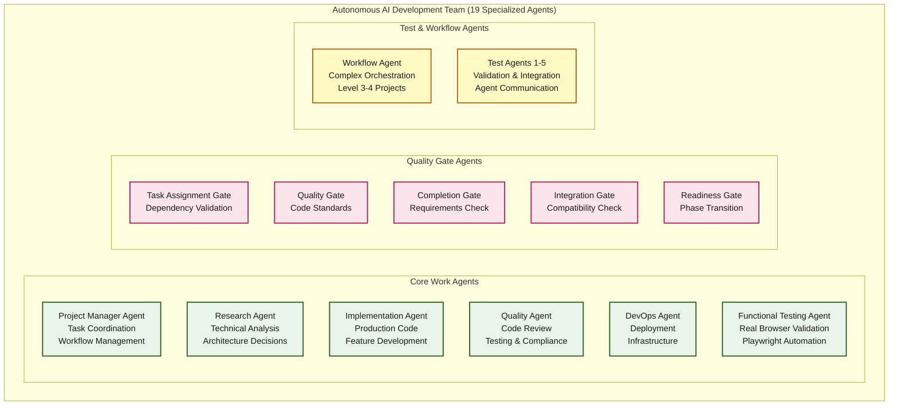
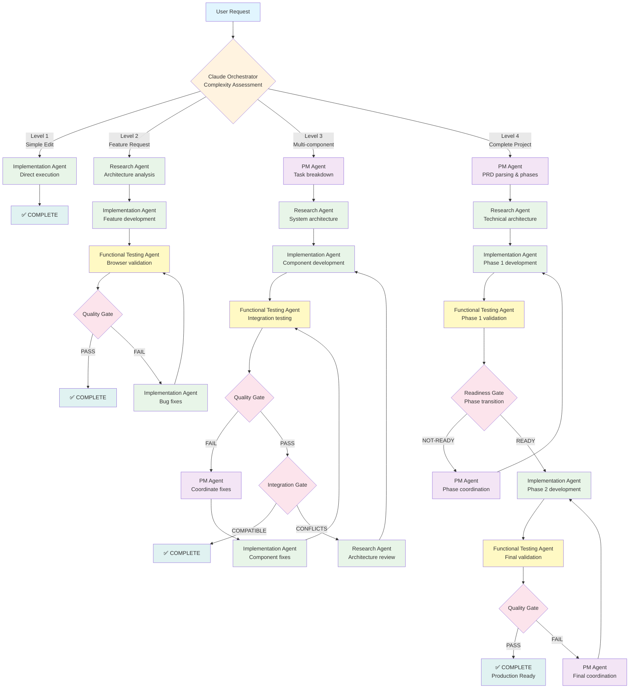

# Autonomous AI Development Team

## What it does

Turn a natural language request into a production-ready application with 19 specialized AI agents coordinated through Claude's CLAUDE.md orchestration system.

### Request Examples by Complexity Level

**Level 1 (Simple edits):**
```
"Fix the typo in line 23 of app.js"
"Add a comment explaining the calculateTotal function"
"Update the button text from 'Submit' to 'Save'"
```

**Level 2 (Feature development):**
```  
"Add user login functionality with JWT authentication"
"Create a search feature for the product catalog"
"Implement dark mode toggle for the application"
```

**Level 3 (Multi-component systems):**
```
"Build a user management system with roles and permissions"
"Create an admin dashboard with analytics and user controls"
"Add a complete API layer with authentication and data validation"
```

**Level 4 (Full projects with PRD):**
```
"Build an e-commerce platform based on this PRD: [PRD file/content]"
"Create a task management application following these requirements: [detailed specs]"
"Develop a social media platform with these features: [comprehensive feature list]"
```

Result: Complete application with browser-tested functionality, zero JavaScript errors, accessibility compliance.

## Architecture

### Agent Organization



### Complexity-Based Orchestration Flow



## How it works

**Multi-agent coordination**: Main Claude uses CLAUDE.md orchestration instructions to assess complexity (Level 1-4) and route tasks to specialized agents via the Task tool.

**Browser validation**: Functional testing agent uses Playwright MCP to test actual functionality in real browsers, catching bugs that static analysis misses.

**Quality gates**: Binary validation at each step (PASS/FAIL). Failed gates route back for fixes until validation passes.

**Error recovery**: Quality Gate FAIL → Implementation Agent fixes → Re-validation PASS

## Dependencies Required

### Core MCP Servers

**Task Master MCP** (Required for PM agent coordination):
```bash
claude mcp add task-master -s user -- npx -y --package=task-master-ai task-master-ai
```

**Context7 MCP** (Required for research agent library documentation):
```bash
claude mcp add context7 -s user -- npx -y context7-server
```

**Playwright MCP** (Required for functional testing agent browser automation):
```bash
claude mcp add playwright -s user -- npx -y playwright-mcp-server
```

### Agent Tool Distribution

- **PM Agent**: Full Task Master MCP access + file operations
- **Research Agent**: Context7 MCP, web search, limited Task Master read-only  
- **Implementation Agent**: File operations (Read, Write, Edit, MultiEdit, Bash, Glob, Grep) + Task Master read-only
- **Functional Testing Agent**: Playwright MCP, Bash, limited Task Master read-only
- **Quality/Gate Agents**: Read-only access for validation

## Quick Start

### 1. Install MCP Dependencies
```bash
# Task Master (project coordination)
claude mcp add task-master -s user -- npx -y --package=task-master-ai task-master-ai

# Context7 (library documentation)  
claude mcp add context7 -s user -- npx -y context7-server

# Playwright (browser testing)
claude mcp add playwright -s user -- npx -y playwright-mcp-server
```

### 2. Initialize Project  
```bash
# Create project directory
mkdir your-project && cd your-project

# Initialize TaskMaster
npx task-master-ai init

# Configure for Claude Code (free)
npx task-master-ai models --setMain claude-code/sonnet --setResearch claude-code/sonnet
```

### 3. Make Natural Language Request
Simply talk to Claude:
```
"Build a responsive todo app with dark mode, date functionality, and accessibility compliance"
```

**What happens automatically:**
1. Claude assesses complexity using CLAUDE.md instructions
2. Routes to PM agent for task breakdown using Task Master MCP
3. PM agent coordinates research phase via Task tool
4. Research agent analyzes architecture using Context7 MCP  
5. Implementation agent builds application with guidance
6. Functional testing agent validates in browser using Playwright MCP
7. Quality gates ensure production readiness

## Tested Capabilities

**Validated project types:**
- Frontend applications (React, Vue, Angular, Vanilla JS)
- API integrations with security best practices  
- Responsive design with accessibility compliance

**Quality standards delivered:**
- TypeScript with strict mode
- Zero JavaScript errors (browser-tested)
- WCAG accessibility compliance
- Professional code organization
- Comprehensive testing

**Real test case**: Todo system initially failed (broken dark mode, add functionality). Functional testing agent identified specific JavaScript date formatting bugs using Playwright automation. Implementation agent fixed issues. Final validation passed with working functionality.

**Zero cost**: Uses Claude Code integration, eliminating API expenses.


## Technical Notes

**Orchestration**: Main Claude uses CLAUDE.md instructions (not slash commands) to coordinate agents via Task tool.

**State management**: Task Master MCP maintains project state, task breakdown, and progress tracking.

**Agent communication**: Agents are stateless - main Claude maintains context and routes work.

**Browser testing**: Playwright MCP enables real browser validation, not just code review.

**Documentation**: Context7 MCP provides up-to-date library documentation during research phase.

## Contributing

Areas needing improvement:
1. Task Master MCP reliability fixes
2. Better error recovery mechanisms  
3. Backend/mobile project support
4. Scalability testing for larger projects
5. Clean up outdated .claude/commands/ files

## Results

Delivers production-ready applications from natural language requests. The breakthrough is functional browser validation - guaranteeing applications actually work, not just passing code review.

Built on [cursor-memory-bank](https://github.com/vanzan01/cursor-memory-bank) foundation (2,400+ stars).