# Hub-and-Spoke Agent Coordination Research

## A Message from the Creator

> Hi everyone! Since the launch of [Cursor Memory Bank](https://github.com/vanzan01/cursor-memory-bank) (2,400+ stars), I haven't stopped innovating and exploring new possibilities. When Claude Code was released, I immediately moved to it and have been working on fresh ideas and solutions as you can see throughout my repositories. 
>
> **This isn't just another agent repository.** This is pioneering work in what's now being called **Context Engineering** - the emerging field of structuring everything an LLM needs (prompts, memory, tools, data) to make intelligent, autonomous decisions reliably.
>
> While researching my cursor memory bank project, I discovered that **agents don't hold context well, lose context often, and forget the things you say**. This is the core challenge that context engineering aims to solve.
>
> My solution implements true **context engineering principles**: a **graph-based JIT context loading system** that provides agents exactly the context they need, when they need it. Combined with **HANDOFF_TOKEN validation** to confirm agent comprehension and **hub-and-spoke coordination** to eliminate context drift - this represents a complete context engineering architecture.
>
> What makes this unique is that instead of overwhelming agents with global context (which causes them to lose focus), my system uses **just-in-time context delivery** - agents get precisely relevant context loaded dynamically based on their specific task. This is context engineering in practice.
>
> Now, with Claude Code's agent mode, I'm making another attempt at what I originally tried with Cursor Memory Bank—but with context engineering principles, hooks, and coordinated agents, I can get much closer to creating a truly autonomous development team.
>
> I hope you enjoy this journey with me. I will continue leading with my original thoughts and ideas—come be part of the adventure!

---

## Research: Solving Multi-Agent Coordination

After hundreds of hours researching agent coordination problems in my Cursor Memory Bank project, I identified three critical failures that plague ALL multi-agent systems:

**🔥 Context Degradation** - Agents lose context across interactions and forget critical instructions  
**🔥 Coordination Drift** - Peer-to-peer communication becomes unreliable and non-deterministic  
**🔥 Quality Inconsistency** - Agents skip steps and behave inconsistently without enforcement

### Research Breakthroughs

**📊 JIT Context Loading** - Agents get exactly the context they need, when they need it (prevents information overload)

**🔗 Hub-and-Spoke Pattern** - Zero peer communication, all coordination through central hub (eliminates context drift)

**🔒 HANDOFF_TOKEN Validation** - Progressive retry system confirms agents actually processed instructions (ensures comprehension)

---

## Usage

Research framework for reliable multi-agent coordination.

**Usage:** `@routing-agent your request`

**Core Innovation:** Solves fundamental agent coordination problems through hub-and-spoke pattern, HANDOFF_TOKEN validation, and mandatory quality gates.

## Quick Start

1. Copy `.claude/` directory to your project
2. Install MCP dependencies: task-master, context7, playwright
3. Use: `@routing-agent your request`

## System Management

### Using the VAN Maintenance Agent

The **van-maintenance-agent** manages the agent ecosystem and handles system maintenance:

```bash
@van-maintenance-agent [maintenance task]
```

**Common Use Cases:**

**🆕 Adding New Agents**
```bash
@van-maintenance-agent integrate new agent [agent-name] into the ecosystem
```
- Automatically updates interaction diagrams
- Adds agent to categorization system
- Creates proper handoff relationships
- Updates workflow patterns

**🔧 Troubleshooting Agent Issues**
```bash
@van-maintenance-agent fix mermaid syntax errors in agent files
@van-maintenance-agent update agent relationships after changes
@van-maintenance-agent validate handoff token consistency
```

**📊 System Health Checks**
```bash
@van-maintenance-agent perform comprehensive ecosystem audit
@van-maintenance-agent analyze agent categorization accuracy
@van-maintenance-agent review workflow pattern coverage
```

**🛠️ Documentation Maintenance**
```bash
@van-maintenance-agent update agent interaction documentation
@van-maintenance-agent fix outdated agent relationships
@van-maintenance-agent validate ecosystem integrity
```

The van-agent ensures your agent ecosystem stays healthy and properly coordinated as it evolves.

## Architecture

**Central Hub (routing-agent):** Graph-based semantic analysis, JIT context loading
**Quality Gates:** 6 mandatory gates with no bypass (Planning → Infrastructure → Implementation → Testing → Polish → Completion)
**Specialized Agents:** Ultra-narrow domain focus (component, feature, infrastructure, testing, polish)
**Validation:** HANDOFF_TOKEN system with progressive retry

### Hub-and-Spoke Coordination Architecture

```mermaid
graph TB
    subgraph "Research Framework"
        subgraph "Central Hub"
            RA[🎯 Routing Agent<br/>Semantic Analysis]
        end
        
        subgraph "Coordination"  
            EPM[🏗️ Project Manager<br/>6 Quality Gates]
        end
        
        subgraph "Research"
            PRD[📋 PRD Research<br/>Context7]
            RESEARCH[🔬 Research Agent<br/>Analysis]
        end
        
        subgraph "Implementation"
            COMP[🎨 Components<br/>UI & Styling]
            FEAT[💾 Features<br/>Business Logic]
            INFRA[🏗️ Infrastructure<br/>Build & Deploy]
            TEST[🧪 Testing<br/>Validation]
            POLISH[✨ Polish<br/>Performance]
        end
        
        subgraph "Quality Gates"
            EQG[🛡️ Quality Gate]
            CG[✅ Complete Gate]
            RG[🎯 Ready Gate]
        end
        
        subgraph "System"
            HOOKS[⚙️ Hooks<br/>Validation]
            TM[📊 TaskMaster<br/>State]
        end
    end
    
    %% Hub connections
    RA -.-> EPM
    RA -.-> PRD
    RA -.-> RESEARCH
    RA -.-> COMP
    RA -.-> FEAT
    RA -.-> INFRA
    RA -.-> TEST
    RA -.-> POLISH
    
    %% Return to hub
    EPM -.-> RA
    PRD -.-> RA
    RESEARCH -.-> RA
    COMP -.-> RA
    FEAT -.-> RA
    INFRA -.-> RA
    TEST -.-> RA
    POLISH -.-> RA
    
    %% Quality flow
    EPM --> EQG --> CG --> RG
    
    %% System coordination
    HOOKS -.-> RA
    TM -.-> EPM
    
    classDef hub fill:#ffd700,stroke:#ff8c00,stroke-width:4px,color:#1a1a1a
    classDef coordination fill:#e3f2fd,stroke:#1976d2,stroke-width:3px,color:#1a1a1a
    classDef research fill:#f3e5f5,stroke:#7b1fa2,stroke-width:3px,color:#1a1a1a
    classDef implementation fill:#e8f5e8,stroke:#2d5a27,stroke-width:3px,color:#1a1a1a
    classDef quality fill:#fce4ec,stroke:#a91e63,stroke-width:3px,color:#1a1a1a
    classDef system fill:#fff3e0,stroke:#f57c00,stroke-width:2px,color:#1a1a1a
    
    class RA hub
    class EPM coordination
    class PRD,RESEARCH research
    class COMP,FEAT,INFRA,TEST,POLISH implementation
    class EQG,CG,RG quality
    class HOOKS,TM system
```



### Semantic Analysis & JIT Context Loading

```mermaid
graph TD
    REQUEST[👤 REQUEST] --> PARSE[🧠 SEMANTIC<br/>ANALYSIS]
    
    PARSE --> CLASSIFY{🎯 INTENT<br/>CLASSIFICATION}
    
    CLASSIFY -->|UI| UI[🎨 UI CONTEXT<br/>JIT LOAD]
    CLASSIFY -->|DATA| DATA[💾 DATA CONTEXT<br/>JIT LOAD]
    CLASSIFY -->|BUILD| BUILD[🏗️ BUILD CONTEXT<br/>JIT LOAD]
    CLASSIFY -->|TEST| TEST[🧪 TEST CONTEXT<br/>JIT LOAD]
    CLASSIFY -->|INFO| INFO[🔬 RESEARCH CONTEXT<br/>JIT LOAD]
    
    UI --> AGENT_UI[🎨 COMPONENT<br/>AGENT]
    DATA --> AGENT_DATA[💾 FEATURE<br/>AGENT]
    BUILD --> AGENT_BUILD[🏗️ INFRASTRUCTURE<br/>AGENT]
    TEST --> AGENT_TEST[🧪 TESTING<br/>AGENT]
    INFO --> AGENT_INFO[🔬 RESEARCH<br/>AGENT]
    
    AGENT_UI --> TOKEN[🔒 HANDOFF<br/>TOKEN]
    AGENT_DATA --> TOKEN
    AGENT_BUILD --> TOKEN
    AGENT_TEST --> TOKEN
    AGENT_INFO --> TOKEN
    
    TOKEN --> VALIDATE{✅ VALID?}
    
    VALIDATE -->|PASS| SUCCESS[🎯 EXECUTE<br/>WITH CONTEXT]
    VALIDATE -->|FAIL| RETRY[🔄 RETRY<br/>3X MAX]
    
    RETRY --> ESCALATE[🆘 ESCALATE<br/>TO PM]
    
    SUCCESS -.-> HUB[🔄 RETURN<br/>TO HUB]
    ESCALATE -.-> HUB
    HUB -.-> PARSE
    
    classDef input fill:#e1f5fe,stroke:#0277bd,stroke-width:4px,color:#1a1a1a,font-size:18px
    classDef semantic fill:#ffd700,stroke:#ff8c00,stroke-width:6px,color:#1a1a1a,font-size:20px
    classDef classify fill:#e3f2fd,stroke:#1976d2,stroke-width:4px,color:#1a1a1a,font-size:16px
    classDef context fill:#f3e5f5,stroke:#7b1fa2,stroke-width:3px,color:#1a1a1a,font-size:16px
    classDef agent fill:#e8f5e8,stroke:#2d5a27,stroke-width:3px,color:#1a1a1a,font-size:16px
    classDef token fill:#fce4ec,stroke:#a91e63,stroke-width:4px,color:#1a1a1a,font-size:16px
    classDef validate fill:#fff3e0,stroke:#f57c00,stroke-width:3px,color:#1a1a1a,font-size:16px
    classDef system fill:#f1f8e9,stroke:#689f38,stroke-width:3px,color:#1a1a1a,font-size:16px
    
    class REQUEST input
    class PARSE semantic
    class CLASSIFY classify
    class UI,DATA,BUILD,TEST,INFO context
    class AGENT_UI,AGENT_DATA,AGENT_BUILD,AGENT_TEST,AGENT_INFO agent
    class TOKEN token
    class VALIDATE validate
    class SUCCESS,RETRY,ESCALATE,HUB system
```



## Research Results

- **Improved** context retention through hub-and-spoke vs peer communication
- **Improved** instruction following with HANDOFF_TOKEN validation
- **Improved** quality compliance through mandatory gates vs optional checks
- **Improved** knowledge integration with Context7 vs stale training data

## Dependencies

```bash
claude mcp add task-master -s user -- npx -y --package=task-master-ai task-master-ai
claude mcp add context7 -s user -- npx -y context7-server
claude mcp add playwright -s user -- npx -y playwright-mcp-server
```

## Key Files

- `.claude/agents/routing-agent.md` - Central hub with graph-based routing
- `.claude/agents/enhanced-project-manager-agent.md` - 6-gate quality process
- `.claude/agents/van-maintenance-agent.md` - Agent ecosystem maintenance
- `.claude/hooks/routing-executor.sh` - HANDOFF_TOKEN validation

**Built on**: [cursor-memory-bank](https://github.com/vanzan01/cursor-memory-bank) (2,400+ stars) research into agent coordination problems.