# 🤖 World's First Autonomous AI Development Team

## 🚀 Single Command → Complete Production Application

```bash
# Create PRD file, then run:
/project:tm-orchestrator-simple

# Result: Complete production-ready application with:
✅ Research-driven architecture decisions
✅ Professional code structure  
✅ Comprehensive testing
✅ Accessibility compliance
✅ MVP-ready governance
```

**This is not just code generation. This is autonomous software development.**

---

## 🧠 The Breakthrough: Multi-Agent AI Coordination

After [cursor-memory-bank](https://github.com/vanzan01/cursor-memory-bank) hit 1,800+ stars, I couldn't stop thinking: **What if AI agents could work together like a real development team?**

**The result:** The world's first practical autonomous development system where specialized AI agents coordinate to build complete applications from requirements to production.

### 🎯 Meet Your AI Development Team

```mermaid
graph TB
    subgraph "🎯 User Input"
        PRD[📄 Product Requirements Document]
    end
    
    subgraph "🤖 Autonomous AI Development Team"
        Orchestrator[🎭 Orchestrator Agent<br/>Strategic Coordination<br/>Quality Gates]
        Research[🔬 Research Agent<br/>Technical Analysis<br/>Architecture Decisions]
        Implementation[⚡ Implementation Agent<br/>Production Code<br/>Testing & Quality]
        Structure[🏗️ Structure Enforcer<br/>Project Governance<br/>Technical Standards]
    end
    
    subgraph "🎉 Output"
        App[🚀 Production Application<br/>✅ Tested & Accessible<br/>✅ Professional Structure<br/>✅ MVP Quality]
    end
    
    PRD --> Orchestrator
    Orchestrator --> Research
    Research --> Implementation
    Implementation --> Structure
    Structure --> App
```



### ⚡ Agent Coordination Flow

1. **🎭 Orchestrator Agent**: Reads PRD → Plans development strategy → Coordinates team
2. **🔬 Research Agent**: Technical analysis → Architecture decisions → Implementation guides  
3. **⚡ Implementation Agent**: Production code → Testing → Quality assurance
4. **🏗️ Structure Enforcer**: Project organization → Technical debt prevention → Standards compliance

**Key Innovation:** Agents seamlessly hand off context through TaskMaster tags, maintaining project continuity across complex development phases.

---

## 🎮 Alpha Release: Proof of Autonomous Development

### 🧪 Real-World Test Results

**Challenge:** Build a complete Vue.js todo application from PRD to production

**Execution:** 
- **Multi-agent coordination test across 45 minutes** ⏱️
- **Zero human intervention** during development
- **Production-quality output** with professional structure

**Results:**
- ✅ Complete Vue 3 application with TypeScript
- ✅ Comprehensive test suite (Vitest)
- ✅ Accessibility compliance (WCAG 2.1 AA)
- ✅ Professional project structure
- ✅ Local storage persistence
- ✅ Responsive design

### 🚨 Current Limitations (Alpha Release)

**TaskMaster MCP Reliability**: ~15% API failure rate on complex operations
- **Impact**: Occasional need to retry failed task operations
- **Workaround**: Agents automatically retry failed operations
- **Status**: Working with TaskMaster team on improvements

This is MVP-ready technology, not production-enterprise. We're honest about current limitations while building toward full reliability.

---

## 🛠️ Quick Start Guide

### Prerequisites
```bash
# Install TaskMaster MCP in Claude Code
claude mcp add task-master -s user -- npx -y --package=task-master-ai task-master-ai
```

### Single-Command Development
```bash
# 1. Create your PRD file in project directory
# 2. Run the orchestrator
/project:tm-orchestrator-simple

# The AI team handles the rest:
# → Strategic planning
# → Technical research  
# → Implementation
# → Testing & quality
# → Project governance
```

### Manual Multi-Agent Mode
```bash
# Step-by-step coordination
/project:tm-parse-prd           # Orchestrator: Parse requirements
/project:tm-research            # Research Agent: Technical analysis
/project:tm-implementation      # Implementation Agent: Build application
/project:tm-structure-enforce   # Structure Enforcer: Governance check
```

---

## 🎯 Revolutionary Features

### 🤖 True Agent Autonomy
- **Strategic Thinking**: Agents make architectural decisions based on research
- **Context Handoffs**: Seamless coordination through TaskMaster tag system
- **Quality Gates**: Continuous validation without human micromanagement
- **Adaptive Planning**: Agents adjust approach based on complexity analysis

### 🧠 Research-Driven Development
- **ADR Generation**: Automatic architectural decision records
- **Technology Analysis**: Comprehensive evaluation of technical options
- **Implementation Guides**: Detailed development roadmaps
- **Best Practice Integration**: Industry standards automatically applied

### ⚡ Continuous Quality Integration
- **Automated Testing**: Test generation and validation
- **Code Quality**: Lint/type checking throughout development
- **Accessibility**: WCAG compliance built-in
- **Performance**: Optimization strategies applied automatically

### 🏗️ Project Governance
- **Structure Enforcement**: Professional organization standards
- **Technical Debt Prevention**: Proactive quality management
- **Documentation**: Automatic technical documentation
- **Configuration Management**: Proper setup and tooling

---

## 🔮 The Philosophy: AI Agents as Creative Partners

**Traditional Approach**: Human plans → AI executes → Human reviews
**Revolutionary Approach**: AI team collaborates → Human provides vision

### 🎯 Trust Levels for Different Users

**🚀 YOLO Mode**: `Full autonomous development`
- Perfect for: Proof of concepts, learning projects
- Agent freedom: Maximum creative control
- Human involvement: Vision and final review

**🎯 Guided Mode**: `Strategic oversight with autonomous execution`  
- Perfect for: Professional projects, complex applications
- Agent freedom: Implementation decisions
- Human involvement: Architectural approval, quality gates

**⚡ Sprint Mode**: `Focused autonomous development sessions`
- Perfect for: Feature development, iteration cycles
- Agent freedom: Feature implementation
- Human involvement: Sprint planning and review

**🎪 Surgical Mode**: `Targeted autonomous problem solving`
- Perfect for: Bug fixes, specific enhancements
- Agent freedom: Solution implementation
- Human involvement: Problem definition and validation

---

## 📊 Performance Metrics (Alpha Testing)

### 🧪 Todo Application Case Study

**Development Time**: 45 minutes (autonomous)
**Code Quality**: Production-ready with comprehensive testing
**Architecture**: Research-driven decisions with ADRs
**Accessibility**: WCAG 2.1 AA compliance
**Structure**: Professional project organization

**Traditional Development**: 2-3 days manual development
**AI-Assisted Development**: 6-8 hours with oversight
**Autonomous AI Team**: 45 minutes with strategic coordination

### 🎯 Quality Metrics

- **Test Coverage**: Comprehensive test suites generated
- **Code Standards**: Professional patterns and conventions
- **Documentation**: Technical documentation automatically created
- **Accessibility**: Screen reader compatibility built-in
- **Performance**: Optimized builds and efficient code

---

## 🚨 Known Issues & Roadmap

### Current Alpha Limitations

1. **TaskMaster MCP Reliability**: ~15% failure rate requiring retries
2. **Complex Dependency Management**: Occasional coordination delays
3. **Large Project Scaling**: Context window limitations on massive codebases

### Planned Improvements

- **Enhanced Agent Communication**: Improved context sharing protocols
- **Scaling Architecture**: Support for enterprise-level projects  
- **Quality Metrics**: Real-time development quality dashboards
- **Integration Ecosystem**: CI/CD pipeline integration

---

## 🤝 Community & Contribution

### 🧪 Alpha Testing Program

We're looking for brave developers to push the boundaries:

**What we need:**
- Real project testing (beyond todo apps)
- Edge case discovery
- Performance feedback
- Quality assessment

**What you get:**
- Early access to breakthrough AI development
- Direct influence on roadmap
- Recognition as alpha pioneer
- Support for your autonomous development experiments

### 🔮 Research Collaboration

**Areas of interest:**
- Multi-agent coordination protocols
- Quality gate optimization
- Context handoff mechanisms
- Agent specialization strategies

---

## 📈 Why This Matters

**This isn't just another AI coding tool.** This is a fundamental shift in how software gets built.

### 🎯 The Bigger Picture

- **Democratization**: Complex software accessible to more creators
- **Efficiency**: From weeks to hours for complete applications
- **Quality**: Research-driven decisions lead to better architecture
- **Innovation**: AI teams can explore solutions humans might miss

### 🧠 Technical Philosophy

**Traditional**: Human intelligence → AI execution
**Revolutionary**: AI intelligence ↔ Human vision

The future of software development is collaborative intelligence, not replacement intelligence.

---

## 🎪 Command Reference

### Core Multi-Agent Commands
- `/project:tm-orchestrator-simple` - Full autonomous development team
- `/project:tm-research` - Research Agent for technical analysis
- `/project:tm-implementation` - Implementation Agent for coding
- `/project:tm-structure-enforce` - Structure Enforcer for governance

### Traditional TaskMaster Commands
- `/project:tm-parse-prd` - Parse PRD and generate tasks
- `/project:tm-expand-all` - Break down complex tasks
- `/project:tm-auto-cycle` - Autonomous development cycle
- `/project:tm-list` - View all tasks and progress

All operations use TaskMaster MCP v0.17.0+ for optimal performance.

---

**Ready to experience the future of software development?**

Create a PRD. Run `/project:tm-orchestrator-simple`. Watch AI agents build your vision.

*Welcome to autonomous development.* 🚀