# 🚀 TaskMaster Agent: Push Claude Code to Its Absolute Limits! 

## 🎯 Welcome to the Ultimate AI Agent Experiment

Hey there, fellow Claude Code enjoyer! 👋 

After my [cursor-memory-bank](https://github.com/vanzan01/cursor-memory-bank) hit 1,800+ stars, I couldn't stop thinking about one fundamental problem: **We keep trying to force non-deterministic AI into deterministic task systems.** 

It's like asking a jazz musician to play from a rigid sheet music score - technically possible, but you're missing the magic. 🎺

### 🧠 The Philosophical Challenge

Here's what I learned building this: AI agents don't want to be micromanaged. They want to **think, explore, and make creative decisions**. But they also need structure when they're lost.

**The breakthrough:** Instead of controlling every step, we control the *moments when they need guidance*. It's a delicate dance between:
- **🕊️ Letting them fly** - Creative problem-solving and autonomous execution  
- **🎯 Gentle guidance** - Clear objectives and quality guardrails
- **🤝 Trust with verification** - They build, we validate, everyone wins

### 🔥 What Makes This Different?

- **🤖 AI-First Architecture**: Designed around how Claude actually thinks, not how we think it should think
- **💎 Free DeepSeek Models**: Proving intelligence > expense (this runs on models that cost $0)
- **🧠 Ultra-Think Mode**: Watch Claude dive deep into architectural decisions and emerge with surprising insights
- **⚡ Variable Trust Levels**: From "check every step" to "wake me when it's done"
- **🎪 Real Autonomy**: Not just code completion - actual project management and strategic thinking

### 🌟 The Core Insight

Most people use TaskMaster as a glorified todo list with human oversight. **But what if the AI is actually a better project manager than we are?**

This framework lets Claude:
- 📋 **Architect thoughtfully** - Design comprehensive solutions, not just implement features
- 🔍 **Think systemically** - See connections and dependencies we might miss
- 🏗️ **Execute relentlessly** - Build without getting tired, distracted, or discouraged
- 🧪 **Iterate fearlessly** - Try bold approaches because rollback is always possible

### 🎮 How Much Do You Trust It?

The real question isn't "Can AI code?" - it's "Can you let go of control long enough to see what AI can really do?"

**Four Trust Levels:**
- 🚀 **YOLO Mode**: `/project:tm-auto-cycle` - "See you in 6 hours, Claude. Build me something amazing."
- 🎯 **Guided Mode**: `/project:tm-auto-dev` - "Show me each major decision, then execute autonomously"
- ⚡ **Sprint Mode**: `/project:tm-sprint` - "Focus on this feature set, make it happen"  
- 🎪 **Surgical Mode**: `/project:tm-implement [id]` - "Handle this specific complexity for me"

### 🤝 The Fine Balancing Act

This isn't about replacing human creativity - it's about **amplifying it**. You focus on vision and product direction. Claude handles the architectural thinking and implementation grind.

**The magic happens when you find the sweet spot between:**
- Control ↔ Freedom
- Structure ↔ Creativity  
- Safety ↔ Innovation

Try it out, break it, push it further! Tell me:
- How far did Claude surprise you?
- Where did the balance feel right?
- What made you uncomfortable (and why that might be important)?
- What would you never let it do autonomously?

**Happy Clauding!** ✨

---

## 🎨 TaskMaster MCP Workflow Architecture

```mermaid
flowchart TB
    %% Input & Setup
    PRD[📄 Product Requirements Document<br/>Vision • Features • Technical Specs]
    
    %% Core TaskMaster MCP Flow
    PRD --> Parse[🧠 AI Task Generation<br/>/project:tm-parse-prd]
    Parse --> Tasks[(📋 Task Database<br/>tasks.json)]
    
    Tasks --> Analyze[🔍 Complexity Analysis<br/>/project:tm-analyze]
    Analyze --> Expand[🌳 Task Expansion<br/>/project:tm-expand-all]
    
    %% Engagement Modes
    Expand --> Gateway{🎮 Choose Your Adventure}
    
    Gateway --> YOLO[🚀 YOLO Mode<br/>/project:tm-auto-cycle<br/>Full Autonomous]
    Gateway --> Controlled[🎯 Controlled Mode<br/>/project:tm-auto-dev<br/>Step-by-Step]
    Gateway --> Sprint[⚡ Sprint Mode<br/>/project:tm-sprint<br/>Batch Execution]
    Gateway --> Surgical[🎪 Surgical Mode<br/>/project:tm-implement<br/>Target Specific]
    
    %% Development Cycle
    YOLO --> DevCycle[🔄 Autonomous Dev Cycle]
    Controlled --> DevCycle
    Sprint --> DevCycle
    Surgical --> DevCycle
    
    DevCycle --> CodeGen[💻 Code Generation]
    CodeGen --> Tests[🧪 Testing & QA]
    Tests --> Commit[📝 Git Commit]
    Commit --> NextTask{More Tasks?}
    
    NextTask -->|Yes| DevCycle
    NextTask -->|No| Complete[🎉 Project Complete!]
    
    %% Monitoring & Control
    DevCycle -.-> Monitor[📊 Progress Monitoring<br/>/project:tm-list<br/>/project:tm-show]
    Monitor -.-> DevCycle
    
    %% Styling
    classDef aiProcess fill:#ff6b6b,stroke:#c92a2a,stroke-width:2px,color:#fff
    classDef userChoice fill:#4ecdc4,stroke:#26a69a,stroke-width:2px,color:#fff
    classDef automation fill:#45b7d1,stroke:#2980b9,stroke-width:2px,color:#fff
    classDef data fill:#96ceb4,stroke:#6ab04c,stroke-width:2px,color:#333
    classDef complete fill:#feca57,stroke:#ff9ff3,stroke-width:3px,color:#333
    
    class Parse,Analyze,Expand,CodeGen,Tests aiProcess
    class Gateway,YOLO,Controlled,Sprint,Surgical userChoice
    class DevCycle,Commit,NextTask automation
    class PRD,Tasks,Monitor data
    class Complete complete
```



---

# TaskMaster: Complete User Manual

Your step-by-step guide to autonomous AI-powered software development with TaskMaster.

## Overview

TaskMaster transforms software development by using AI to parse requirements, generate tasks, analyze complexity, and autonomously implement code. This manual walks you through the complete workflow from MCP installation to autonomous development.

## Installation

### Install TaskMaster MCP in Claude Code
```bash
claude mcp add task-master -s user -- npx -y --package=task-master-ai task-master-ai
```

**What this does:**
- Installs TaskMaster MCP tools
- Configures all necessary dependencies
- Makes TaskMaster commands available in Claude Code
- Ready for immediate use (no additional setup required)

### Post-Installation Setup

After running `/project:tm-init`, TaskMaster creates several files for IDE integration:

**Files created during initialization:**
- `.claude/commands/tm-*.md` - TaskMaster command definitions for Claude Code
- `.claude/settings.local.json` - Claude Code IDE settings
- `.env.example` - Environment configuration template
- `.taskmaster/` directory - TaskMaster project files and configuration

**Required Setup:**
1. **Rename environment template**: `mv .env.example .env`
2. **Add your OpenRouter API key**: Edit `.env` and add your `OPENROUTER_API_KEY=your_key_here`
3. **Keep essential files**: `.env`, `.taskmaster/` directory, and `.claude/commands/` are all needed

**Optional Cleanup:**
- Remove other IDE config files if you only use Claude Code
- Keep `.env` in `.gitignore` to protect your API keys

## Prerequisites

- Claude Code installed
- TaskMaster MCP installed (see above)
- Project directory ready for development
- Product Requirements Document (PRD) prepared

## Phase 1: PRD Setup

### Step 1: Create Your PRD
Create a PRD file in your project directory with:
- Project goals and vision
- Core features and functionality  
- Technical requirements and constraints
- User stories and acceptance criteria
- Database schemas (if applicable)
- Performance and security requirements

**PRD Best Practices:**
- Be specific about technologies/frameworks
- Include user stories and acceptance criteria
- Specify database schemas if applicable
- Mention performance and security requirements

## Phase 2: Task Generation

### Step 2: Parse PRD and Generate Tasks
```
/project:tm-parse-prd
```
**What it does:**
- Reads your PRD document
- Uses AI to generate structured development tasks
- Creates dependency relationships
- Assigns priorities and complexity estimates

**Expected output:** 10-30 tasks in `.taskmaster/tasks/tasks.json`

**Quick verification:** After parsing, you can also view your tasks from bash:
```bash
task-master list
```

### Step 3: Review Generated Tasks
```
/project:tm-list
```
**Review checklist:**
- Do tasks cover all PRD requirements?
- Are priorities appropriate?
- Do dependencies make sense?
- Any missing or unnecessary tasks?

**Optional:** Add additional tasks if needed
```
/project:tm-add "Implement additional feature X"
```

## Phase 3: Task Analysis & Preparation

### Step 4: Analyze Task Complexity
```
/project:tm-analyze
```
**What it does:**
- Evaluates each task's complexity (1-10 scale)
- Identifies tasks needing breakdown
- Generates expansion recommendations
- Creates complexity report

**Expected output:** 
- High complexity tasks (8-10): Need expansion
- Medium complexity tasks (5-7): Consider expansion  
- Low complexity tasks (1-4): Ready for development

### Step 5: Expand Complex Tasks
**Option A:** Expand all eligible tasks
```
/project:tm-expand-all
```

**Option B:** Expand specific tasks
```
/project:tm-expand 5
/project:tm-expand 12
```

**What expansion does:**
- Breaks complex tasks into 3-7 subtasks
- Creates detailed implementation steps
- Maintains dependency relationships
- Provides clearer development path

### Step 6: Final Review
```
/project:tm-list --with-subtasks
```
**Verify:**
- All complex tasks are expanded
- Subtasks are logical and actionable
- Dependencies are correct
- Ready for autonomous development

## Phase 4: Autonomous Development

### Option 1: Full Autonomous Mode (Recommended)
```
/project:tm-auto-cycle
```
**What happens:**
- Executes ALL available tasks automatically
- Follows dependency order
- Implements code with testing
- Commits after each completion
- Runs until project complete

**Best for:** Well-defined projects with clear requirements

### Option 2: Controlled Single-Task Mode
```
/project:tm-auto-dev
```
**What happens:**
- Executes next available task
- Complete implementation with testing
- Updates task status to done
- Waits for your command to continue

**Best for:** When you want oversight between tasks

### Option 3: Sprint-Based Development
```
/project:tm-sprint --priority high
```
**What happens:**
- Executes batch of related tasks
- Focuses on specific priority level
- Sprint planning and review
- Quality gates throughout

**Best for:** Feature-focused development sessions

### Option 4: Targeted Implementation
```
/project:tm-implement 5
```
**What happens:**
- Implements specific task by ID
- Handles all subtasks
- Complete testing workflow
- Updates status when done

**Best for:** Specific high-priority or blocked tasks

## Phase 5: Monitoring & Management

### Track Progress
```
/project:tm-list
/project:tm-next
```

### Check Specific Tasks
```
/project:tm-show 5
```

### Update Status Manually (if needed)
```
/project:tm-status 5 done
```

### Add New Tasks During Development
```
/project:tm-add "Handle edge case discovered during testing"
```

## Quality Assurance Features

**Automatic Quality Checks:**
- Runs existing tests after each task
- Checks for lint/type errors
- Validates no regressions
- Follows existing code patterns

**Safety Features:**
- Commits after each completed task
- Stops for manual review of critical tasks
- Validates changes before proceeding
- Creates backups before major changes

## Common Workflows

### Quick Start (15 minutes setup → autonomous development)
1. Install MCP: `claude mcp add task-master -s user -- npx -y --package=task-master-ai task-master-ai`
2. Create PRD file in your project directory
3. `/project:tm-parse-prd`
4. `/project:tm-expand-all`
5. `/project:tm-auto-cycle`

### Controlled Development (oversight between tasks)
1-4. Same setup steps as Quick Start  
5. Repeatedly run `/project:tm-auto-dev` with review between tasks

### Sprint-Based Development (focused sessions)
1-4. Same setup steps as Quick Start
5. `/project:tm-sprint --priority high` (work on critical tasks first)
6. `/project:tm-sprint --priority medium` (continue with medium priority)

## Troubleshooting

### Task Generation Issues
- **Too few tasks:** Make PRD more detailed
- **Tasks too vague:** Add technical specifications to PRD
- **Missing dependencies:** Manually add with `/project:tm-add-dependency`

### Development Issues
- **Task fails:** Check task details with `/project:tm-show [id]`
- **Tests failing:** Review implementation requirements
- **Blocked tasks:** Use `/project:tm-status [id] deferred` and continue with others

### Project Management
- **View all commands:** `/project:taskmaster`
- **Check project status:** `/project:tm-list`
- **Find next task:** `/project:tm-next`

## Best Practices

1. **PRD Quality:** Spend time creating a detailed, clear PRD
2. **Review Tasks:** Always review generated tasks before development
3. **Expand Complex:** Break down high-complexity tasks (scores ≥7)
4. **Start Simple:** Begin with high-priority, low-complexity tasks
5. **Monitor Progress:** Check task status regularly during development
6. **Quality First:** Let TaskMaster run tests and quality checks
7. **Iterative:** Add tasks as requirements evolve

## Expected Timeline

- **MCP Installation:** 1 minute
- **PRD Creation:** 10-15 minutes  
- **Task Setup (Phase 2-3):** 5-10 minutes
- **Development (Phase 4):** Autonomous (hours to days depending on project)
- **Total Hands-on Time:** 15-25 minutes setup, then autonomous execution

TaskMaster transforms months of manual development planning into minutes of setup, followed by autonomous AI-powered implementation.

---

## Quick Command Reference

### Core Workflow Commands
- `/project:tm-parse-prd` - Parse PRD and generate tasks
- `/project:tm-expand-all` - Break down complex tasks into subtasks  
- `/project:tm-auto-cycle` - Run full autonomous development cycle
- `/project:tm-list` - View all tasks and progress

### Task Management Commands
- `/project:tm-next` - Get next available task to work on
- `/project:tm-show [id]` - Show detailed task information
- `/project:tm-status [id] [status]` - Update task status
- `/project:tm-add [description]` - Add new task with AI structuring

### Development Commands
- `/project:tm-auto-dev` - Execute next task autonomously (single task)
- `/project:tm-implement [id]` - Implement specific task by ID
- `/project:tm-sprint` - Execute batch of tasks in sprint mode

### Analysis Commands
- `/project:tm-analyze` - Analyze task complexity
- `/project:tm-expand [id]` - Expand specific task into subtasks
- `/project:tm-complexity` - View complexity analysis report

All operations use TaskMaster MCP tools for optimal performance and integration.
