# 🤖 World's First Autonomous AI Development Team

## 🚀 Single Command → Complete Production Application

```bash
# Create PRD file, then run:
/project:tm-orchestrator-simple

# Result: Complete production-ready application with:
✅ Research-driven architecture decisions
✅ Professional code structure  
✅ Comprehensive testing
✅ Accessibility compliance
✅ Enterprise-grade governance
```

**This is not just code generation. This is autonomous software development.**

---

## 🧠 The Breakthrough: Multi-Agent AI Coordination

After [cursor-memory-bank](https://github.com/vanzan01/cursor-memory-bank) hit 1,800+ stars, I couldn't stop thinking: **What if AI agents could work together like a real development team?**

**The result:** The world's first practical autonomous development system where specialized AI agents coordinate to build complete applications from requirements to production.

### 🎯 Meet Your AI Development Team

```mermaid
graph TB
    subgraph "🎯 User Input"
        PRD[📄 Product Requirements Document]
    end
    
    subgraph "🤖 Autonomous AI Development Team"
        Orchestrator[🎭 Orchestrator Agent<br/>Strategic Coordination<br/>Quality Gates]
        Research[🔬 Research Agent<br/>Technical Analysis<br/>Architecture Decisions]
        Implementation[⚡ Implementation Agent<br/>Production Code<br/>Testing & Quality]
        Structure[🏗️ Structure Enforcer<br/>Project Governance<br/>Technical Standards]
    end
    
    subgraph "🎉 Output"
        App[🚀 Production Application<br/>✅ Tested & Accessible<br/>✅ Professional Structure<br/>✅ Enterprise Quality]
    end
    
    PRD --> Orchestrator
    Orchestrator --> Research
    Research --> Implementation
    Implementation --> Structure
    Structure --> App
    
    Orchestrator -.->|Coordinates| Research
    Orchestrator -.->|Monitors| Implementation
    Orchestrator -.->|Enforces| Structure
    
    classDef agent fill:#ff6b6b,stroke:#c92a2a,stroke-width:2px,color:#fff
    classDef input fill:#4ecdc4,stroke:#26a69a,stroke-width:2px,color:#fff
    classDef output fill:#feca57,stroke:#ff9ff3,stroke-width:3px,color:#333
    
    class Orchestrator,Research,Implementation,Structure agent
    class PRD input
    class App output
```



### ⚡ How It Works

**1. Research-Driven Development** 🔬
- AI analyzes requirements and researches optimal solutions
- Creates Architectural Decision Records (ADRs) with full rationale
- Generates comprehensive implementation guides

**2. Coordinated Implementation** 🎯
- Orchestrator manages the development pipeline
- Implementation agent follows research guidance
- Continuous quality gates ensure professional standards

**3. Enterprise Governance** 🏗️
- Automatic project structure enforcement
- Technical debt prevention
- Professional documentation generation

---

## 🌟 What Makes This Revolutionary

### 🧠 **True Autonomy, Not Assistance**
- **Complete Project Management**: From PRD to production deployment
- **Strategic Decision Making**: AI makes informed architectural choices
- **Quality Enforcement**: Built-in testing, accessibility, and standards

### 🔬 **Research-Driven Architecture**
- **Technical Analysis**: Deep evaluation of frameworks, patterns, and tools
- **Documented Decisions**: Every choice explained with alternatives considered
- **Implementation Guides**: Detailed patterns and examples for developers

### 🏗️ **Enterprise-Grade Quality**
- **Project Structure Governance**: Professional organization standards
- **Continuous Quality Gates**: Tests, linting, and build validation
- **Accessibility First**: WCAG 2.1 AA compliance built-in

### ⚡ **Proven Results**
- **Production-Ready**: TypeScript, testing, proper error handling
- **Performance Optimized**: Bundle analysis and optimization
- **Team-Ready**: Scalable structure for professional development

---

## 🚀 Quick Start (5 Minutes to Autonomous Development)

### 1. Install TaskMaster MCP
```bash
claude mcp add task-master -s user -- npx -y --package=task-master-ai task-master-ai
```

### 2. Create Product Requirements Document
Create `your-project-prd.txt` with:
```markdown
# Your App Name - Product Requirements Document

## Project Overview
Brief description of what you want to build

## Core Features
1. Feature 1: Description and requirements
2. Feature 2: Description and requirements
3. Feature 3: Description and requirements

## Technical Requirements
- Frontend framework preference (React/Vue/Angular)
- Styling approach (Tailwind/Material-UI/Custom)
- Data persistence needs
- Accessibility requirements
- Testing requirements

## Success Criteria
- Functional requirements
- Performance targets
- Quality standards
```

### 3. Launch Autonomous Development
```bash
/project:tm-orchestrator-simple
```

**That's it.** The AI development team takes over:
- ✅ Parses your requirements
- ✅ Researches optimal solutions  
- ✅ Makes architectural decisions
- ✅ Implements complete application
- ✅ Ensures quality and accessibility
- ✅ Delivers production-ready code

---

## 🎮 Advanced Usage: Individual Agents

### 🔬 Research Agent (Deep Technical Analysis)
```bash
/project:tm-research-agent
```
**What it does:**
- Framework evaluation and selection
- Architecture pattern analysis
- Performance and security considerations
- Creates ADRs and implementation guides

### ⚡ Implementation Agent (Production Development)
```bash
/project:tm-implementation-agent  
```
**What it does:**
- Follows research-driven architecture
- Implements with testing and accessibility
- Enforces code quality standards
- Handles complex integration scenarios

### 🏗️ Project Structure Enforcer (Enterprise Governance)
```bash
/project:tm-project-structure-enforcer
```
**What it does:**
- Enforces professional project organization
- Prevents technical debt accumulation
- Validates configuration standards
- Ensures scalable architecture

### 🎯 Orchestrator (Strategic Coordination)
```bash
/project:tm-orchestrator-simple
```
**What it does:**
- Coordinates all agents automatically
- Manages quality gates and progression
- Makes strategic project decisions
- Ensures end-to-end delivery

---

## 📊 Real-World Results

### 🎯 **Todo Application Case Study**
**Input**: Simple PRD with CRUD requirements  
**Output**: Production Vue 3 application

**Delivered Features:**
- ✅ Vue 3 + TypeScript + Composition API
- ✅ Tailwind CSS responsive design
- ✅ Robust local storage with error handling
- ✅ Complete accessibility (WCAG 2.1 AA)
- ✅ 21 passing unit tests (100% success rate)
- ✅ Enterprise project structure
- ✅ Bundle optimization (42KB gzipped)

**Development Time**: 45 minutes autonomous execution  
**Human Time**: 5 minutes setup + monitoring

### 📈 **Quality Metrics**
- **TypeScript**: 100% type coverage with strict mode
- **Testing**: Comprehensive unit and accessibility tests
- **Performance**: Production-optimized builds
- **Structure**: Professional organization ready for teams
- **Documentation**: Complete ADRs and implementation guides

---

## ⚠️ Alpha Release Limitations

### 🔴 **Known Issues (TaskMaster MCP)**
- **API Reliability**: ~15% failure rate on some operations
- **Manual Intervention**: Occasionally requires retry or workaround
- **Error Recovery**: Limited automatic retry mechanisms

### 🟡 **Tested Scope**
- **Project Types**: Frontend applications (React, Vue, Angular)
- **Complexity**: Small to medium projects (≤50 tasks)
- **Platforms**: Tested on Linux/WSL, Windows, macOS

### ✅ **What Works Reliably**
- **Multi-agent coordination**: Agent handoffs and communication
- **Code quality**: Professional standards and testing
- **Architecture decisions**: Research-driven technical choices
- **Project structure**: Enterprise-grade organization

---

## 🛠️ Architecture Deep Dive

### 🎭 **Agent Coordination Pattern**

```mermaid
sequenceDiagram
    participant User
    participant Orchestrator as 🎭 Orchestrator
    participant Research as 🔬 Research Agent
    participant Implementation as ⚡ Implementation Agent
    participant Structure as 🏗️ Structure Enforcer
    
    User->>Orchestrator: PRD + /project:tm-orchestrator-simple
    Orchestrator->>Orchestrator: Parse requirements & create tasks
    
    Orchestrator->>Research: Analyze technical requirements
    Research->>Research: Framework evaluation & ADR creation
    Research->>Orchestrator: Architecture decisions + guides
    
    Orchestrator->>Implementation: Build with research guidance
    Implementation->>Implementation: Code + tests + accessibility
    Implementation->>Orchestrator: Production-ready features
    
    Orchestrator->>Structure: Enforce governance standards
    Structure->>Structure: Validate structure & quality
    Structure->>Orchestrator: Enterprise-ready project
    
    Orchestrator->>User: 🚀 Complete application delivered
```


### 🔬 **Research-Driven Development Flow**
1. **Requirements Analysis**: Deep understanding of project needs
2. **Technology Evaluation**: Comprehensive framework and tool analysis  
3. **Architecture Design**: Patterns, structures, and integration strategies
4. **Implementation Planning**: Detailed guides with code examples
5. **Quality Standards**: Testing, accessibility, and performance criteria

### ⚡ **Continuous Quality Integration**
- **Quality Gates**: Tests/lint/build validation after each feature
- **Progressive Enhancement**: Accessibility and performance built-in
- **Professional Standards**: Enterprise-grade code organization
- **Documentation**: ADRs, guides, and architectural knowledge preservation

---

## 🤝 Contributing to the AI Development Revolution

### 🐛 **Known Improvement Areas**
1. **TaskMaster MCP Reliability**: Help fix the ~15% API failure rate
2. **Error Recovery**: Better fallback mechanisms for coordination failures  
3. **Project Type Coverage**: Extend to backend, mobile, and full-stack projects
4. **Scalability Testing**: Validate with larger, more complex projects

### 🚀 **Future Enhancements**
- **Real-time Monitoring**: Dashboard for multi-agent development progress
- **Custom Agent Personalities**: Specialized agents for different domains
- **Enterprise Integration**: CI/CD pipeline and deployment automation
- **Learning System**: Agents that improve from project feedback

### 💡 **Research Questions**
- How far can autonomous development scale?
- What's the optimal human-AI collaboration pattern?
- Can agents handle evolving requirements during development?
- How do we measure and improve agent decision quality?

---

## 🏆 Recognition & Impact

**This project represents the first practical implementation of coordinated AI development teams.**

### 📈 **Milestones**
- ✅ **First autonomous multi-agent development system**
- ✅ **Research-driven architecture decisions with full documentation**
- ✅ **Enterprise-grade quality standards and governance**
- ✅ **Production-ready applications from single command**

### 🌟 **Community**
- **cursor-memory-bank**: 1,800+ stars (predecessor project)
- **Revolutionary approach**: Moving beyond AI assistance to AI autonomy
- **Open source**: Contributing to the future of software development

---

## 📞 Let's Build the Future Together

**Try it. Break it. Push it further.**

- 🐛 **Found a bug?** Open an issue with reproduction steps
- 💡 **Have ideas?** Share your vision for autonomous development  
- 🚀 **Built something amazing?** Show the community what AI teams can create
- 🤝 **Want to contribute?** Help improve agent coordination and reliability

**Questions for the Community:**
- How far did the AI team surprise you?
- What would you trust it to build autonomously?
- Where do you see the biggest opportunities for improvement?
- What projects would you want to try with autonomous development?

---

**Ready to experience the future of software development?** 🚀

```bash
# Your journey to autonomous development starts here:
/project:tm-orchestrator-simple
```

**Welcome to the AI development revolution.** ⚡🤖