# Hub-and-Spoke Agent Coordination Research

## A Message from the Creator

> Hi everyone! Since the launch of [Cursor Memory Bank](https://github.com/vanzan01/cursor-memory-bank) (2,400+ stars), I haven't stopped innovating and exploring new possibilities. When Claude Code was released, I immediately moved to it and have been working on fresh ideas and solutions as you can see throughout my repositories. 
>
> **This isn't just another agent repository.** This is the culmination of months of research building on my cursor memory bank project, where I discovered that **agents don't hold context well, lose context often, and forget the things you say**. 
>
> To solve this, I've developed a **graph-based JIT loading system** that allows agents to build context on the fly, **confirm that agents have read the context**, and catch missing information that happens often but goes unnoticed. **Hooks handle deterministic things** ensuring that agents are more accurate.
>
> Now, with Claude Code's agent mode, I'm making another attempt at what I originally tried with Cursor Memory Bank—but with hooks and agents, I can get much closer to creating an autonomous development team. With TaskMaster being operated by my project manager agent, it forms a truly complete team capable of delivering ready-made complex prototypes.
>
> I hope you enjoy this journey with me. I will continue leading with my original thoughts and ideas—come be part of the adventure!

---

## Research: Solving Multi-Agent Coordination

### Core Problems Identified

After hundreds of hours of research following my Cursor Memory Bank project, I identified critical problems that plague ALL multi-agent systems:

**Agent Context Degradation**
- Agents don't hold context well across interactions
- They lose context frequently and miss critical instructions  
- Information gets forgotten or corrupted during handoffs

**Coordination Reliability Issues**
- Agent-to-agent communication creates context drift
- Peer coordination becomes unreliable and non-deterministic
- Missing information happens often but goes unnoticed

**Execution Determinism Problems**
- Agents skip quality steps when not properly enforced
- Inconsistent behavior across different execution runs
- No reliable way to validate agent comprehension

### Research Solutions

**📊 Graph-Based JIT Context Loading**
- **Problem**: Global context becomes overwhelming and agents lose focus
- **Solution**: Decision graphs provide context exactly when/where needed
- **Innovation**: JIT context loading prevents information overload while ensuring relevance

**🔗 Hub-and-Spoke Coordination Pattern**
- **Problem**: Agent-to-agent communication creates unreliable context drift
- **Solution**: Central delegator (routing-agent) maintains conversation context
- **Innovation**: No peer-to-peer agent communication - only hub communication

**✅ Deterministic Validation Systems**
- **Problem**: No reliable way to confirm agents processed instructions correctly
- **Solution**: HANDOFF_TOKEN system validates agent comprehension
- **Innovation**: Progressive retry with escalation ensures reliable coordination

**🛡️ Mandatory Quality Gate Architecture**
- **Problem**: Agents skip quality steps when not enforced
- **Solution**: 6-gate system with NO bypass allowed + retry tracking
- **Innovation**: Quality becomes structural requirement, not optional step

**🧩 Domain Isolation Research**
- **Problem**: Multi-capability agents get confused between responsibilities
- **Solution**: Ultra-narrow agent focus with strict boundary enforcement
- **Innovation**: Agent types that CANNOT do certain actions by design

**📚 Real-Time Knowledge Integration**
- **Problem**: Agents operate on stale training data
- **Solution**: Mandatory Context7 research at every development phase
- **Innovation**: Research compliance tracking throughout development lifecycle

---

## Usage

Research framework for reliable multi-agent coordination.

**Usage:** `@routing-agent your request`

**Core Innovation:** Solves fundamental agent coordination problems through hub-and-spoke pattern, HANDOFF_TOKEN validation, and mandatory quality gates.

## Quick Start

1. Copy `.claude/` directory to your project
2. Install MCP dependencies: task-master, context7, playwright
3. Use: `@routing-agent your request`

## Architecture

**Central Hub (routing-agent):** Graph-based semantic analysis, JIT context loading
**Quality Gates:** 6 mandatory gates with no bypass (Planning → Infrastructure → Implementation → Testing → Polish → Completion)
**Specialized Agents:** Ultra-narrow domain focus (component, feature, infrastructure, testing, polish)
**Validation:** HANDOFF_TOKEN system with progressive retry

### Hub-and-Spoke Coordination Architecture

```mermaid
graph TB
    subgraph "Research Framework"
        subgraph "Central Hub"
            RA[🎯 Routing Agent<br/>Semantic Analysis]
        end
        
        subgraph "Coordination"  
            EPM[🏗️ Project Manager<br/>6 Quality Gates]
        end
        
        subgraph "Research"
            PRD[📋 PRD Research<br/>Context7]
            RESEARCH[🔬 Research Agent<br/>Analysis]
        end
        
        subgraph "Implementation"
            COMP[🎨 Components<br/>UI & Styling]
            FEAT[💾 Features<br/>Business Logic]
            INFRA[🏗️ Infrastructure<br/>Build & Deploy]
            TEST[🧪 Testing<br/>Validation]
            POLISH[✨ Polish<br/>Performance]
        end
        
        subgraph "Quality Gates"
            EQG[🛡️ Quality Gate]
            CG[✅ Complete Gate]
            RG[🎯 Ready Gate]
        end
        
        subgraph "System"
            HOOKS[⚙️ Hooks<br/>Validation]
            TM[📊 TaskMaster<br/>State]
        end
    end
    
    %% Hub connections
    RA -.-> EPM
    RA -.-> PRD
    RA -.-> RESEARCH
    RA -.-> COMP
    RA -.-> FEAT
    RA -.-> INFRA
    RA -.-> TEST
    RA -.-> POLISH
    
    %% Return to hub
    EPM -.-> RA
    PRD -.-> RA
    RESEARCH -.-> RA
    COMP -.-> RA
    FEAT -.-> RA
    INFRA -.-> RA
    TEST -.-> RA
    POLISH -.-> RA
    
    %% Quality flow
    EPM --> EQG --> CG --> RG
    
    %% System coordination
    HOOKS -.-> RA
    TM -.-> EPM
    
    classDef hub fill:#ffd700,stroke:#ff8c00,stroke-width:4px,color:#1a1a1a
    classDef coordination fill:#e3f2fd,stroke:#1976d2,stroke-width:3px,color:#1a1a1a
    classDef research fill:#f3e5f5,stroke:#7b1fa2,stroke-width:3px,color:#1a1a1a
    classDef implementation fill:#e8f5e8,stroke:#2d5a27,stroke-width:3px,color:#1a1a1a
    classDef quality fill:#fce4ec,stroke:#a91e63,stroke-width:3px,color:#1a1a1a
    classDef system fill:#fff3e0,stroke:#f57c00,stroke-width:2px,color:#1a1a1a
    
    class RA hub
    class EPM coordination
    class PRD,RESEARCH research
    class COMP,FEAT,INFRA,TEST,POLISH implementation
    class EQG,CG,RG quality
    class HOOKS,TM system
```



### Graph-Based Semantic Routing Flow


## Research Results

- **Improved** context retention through hub-and-spoke vs peer communication
- **Improved** instruction following with HANDOFF_TOKEN validation
- **Improved** quality compliance through mandatory gates vs optional checks
- **Improved** knowledge integration with Context7 vs stale training data

## Dependencies

```bash
claude mcp add task-master -s user -- npx -y --package=task-master-ai task-master-ai
claude mcp add context7 -s user -- npx -y context7-server
claude mcp add playwright -s user -- npx -y playwright-mcp-server
```

## Key Files

- `.claude/agents/routing-agent.md` - Central hub with graph-based routing
- `.claude/agents/enhanced-project-manager-agent.md` - 6-gate quality process
- `.claude/agents/van-maintenance-agent.md` - Agent ecosystem maintenance
- `.claude/hooks/routing-executor.sh` - HANDOFF_TOKEN validation

**Built on**: [cursor-memory-bank](https://github.com/vanzan01/cursor-memory-bank) (2,400+ stars) research into agent coordination problems.