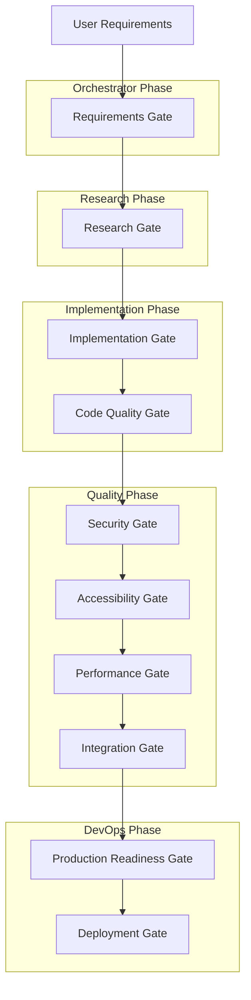

# 🏗️ Quality Gates & Validation Workflows

## 🎯 Enterprise-Grade Quality Assurance

This guide details the comprehensive quality gate system that ensures every component of the autonomous development pipeline meets enterprise-grade standards before progression to the next phase.

## 🧠 Quality Gate Philosophy

### Continuous Quality Integration

**Traditional Approach:**
```
Development → Final Testing → Last-Minute Quality Issues → Rushed Fixes
```

**Autonomous Quality Gates:**
```
Development → Continuous Validation → Progressive Quality Gates → Production Excellence
```

### Core Quality Principles

1. **Shift-Left Quality**: Quality validation integrated from the earliest development stages
2. **Multi-Dimensional Assessment**: Code quality, security, accessibility, performance validation
3. **Automated Validation**: Comprehensive automated testing with manual verification checkpoints
4. **Progressive Gates**: Incremental quality validation with clear progression criteria
5. **Zero-Defect Production**: No critical issues allowed in production deployments

## 🎭 Quality Gate Architecture

### Gate Hierarchy & Dependencies



## 🚪 Gate 1: Requirements Validation

### Gate Owner: Orchestrator Agent

**Validation Criteria:**
```javascript
const requirementsGate = {
  async validateRequirements(userInput) {
    return {
      clarity: this.assessRequirementClarity(userInput),
      completeness: this.checkRequirementCompleteness(userInput),
      feasibility: this.assessTechnicalFeasibility(userInput),
      scope: this.validateProjectScope(userInput),
      qualityStandards: this.identifyQualityRequirements(userInput)
    };
  },

  passedCriteria: {
    clarity: 'Requirements are unambiguous and actionable',
    completeness: 'All core functionality requirements specified',
    feasibility: 'Technical implementation is achievable',
    scope: 'Project scope is well-defined and manageable',
    qualityStandards: 'Quality and compliance requirements identified'
  }
};
```

**Gate Validation Process:**
```javascript
// Orchestrator Agent requirements validation
const requirementsValidation = await validateRequirements(userRequirements);

if (requirementsValidation.passed) {
  // Initialize TaskMaster project with validated requirements
  mcp__task-master__initialize_project(projectRoot, rules: ["claude"]);
  mcp__task-master__parse_prd(input: validatedRequirements, research: true);
  
  // Progress to Research Gate
  await progressToNextGate('research');
} else {
  // Request requirement clarification
  await requestRequirementClarification(requirementsValidation.issues);
}
```

**Gate Metrics:**
- **Requirement Clarity Score**: > 85/100
- **Completeness Index**: > 90%
- **Feasibility Assessment**: Confirmed achievable
- **Scope Definition**: Clear boundaries established

## 🔬 Gate 2: Research & Architecture Validation

### Gate Owner: Research Agent

**Validation Criteria:**
```javascript
const researchGate = {
  async validateResearchOutput(researchFindings) {
    return {
      technicalAnalysis: this.assessTechnicalDepth(researchFindings),
      architecturalDecisions: this.validateArchitecturalChoices(researchFindings),
      implementationGuidance: this.checkImplementationClarity(researchFindings),
      riskAssessment: this.evaluateRiskMitigation(researchFindings),
      qualityFramework: this.validateQualityFramework(researchFindings),
      performanceConsiderations: this.checkPerformancePlanning(researchFindings),
      securityArchitecture: this.validateSecurityDesign(researchFindings)
    };
  },

  passedCriteria: {
    technicalAnalysis: 'Comprehensive technology evaluation completed',
    architecturalDecisions: 'All major architectural choices documented with rationale',
    implementationGuidance: 'Clear, actionable implementation patterns provided',
    riskAssessment: 'Technical risks identified with mitigation strategies',
    qualityFramework: 'Testing and quality standards established',
    performanceConsiderations: 'Performance targets and optimization strategies defined',
    securityArchitecture: 'Security requirements and implementation patterns specified'
  }
};
```

**Research Gate Validation:**
```javascript
// Research Agent comprehensive validation
const researchValidation = await validateResearchOutput(researchFindings);

if (researchValidation.passed) {
  // Create implementation guidance
  mcp__task-master__expand_all(research: true, 
                               prompt: "Create detailed implementation tasks based on research");
  
  // Transfer to Implementation Phase
  mcp__task-master__add_tag(name: "implementation-phase", copyFromCurrent: true);
  await progressToNextGate('implementation');
} else {
  // Conduct additional research for incomplete areas
  await conductAdditionalResearch(researchValidation.gaps);
}
```

**Research Gate Metrics:**
- **Technical Coverage**: 100% of technical decisions addressed
- **Architectural Completeness**: All major components designed
- **Implementation Readiness**: Clear development roadmap provided
- **Risk Mitigation**: All identified risks have mitigation strategies

## ⚡ Gate 3: Implementation Quality Gates

### Gate Owner: Implementation Agent (Continuous) + Quality Agent (Validation)

#### Gate 3A: Code Quality Gate

**Validation Criteria:**
```javascript
const codeQualityGate = {
  async validateCodeQuality(codebase) {
    return {
      architecturalCompliance: this.checkArchitecturalCompliance(codebase),
      codeStandards: this.validateCodingStandards(codebase),
      testCoverage: this.calculateTestCoverage(codebase),
      documentation: this.assessDocumentationQuality(codebase),
      maintainability: this.calculateMaintainabilityIndex(codebase),
      complexity: this.analyzeCyclomaticComplexity(codebase),
      typeScript: this.validateTypeScriptUsage(codebase)
    };
  },

  passedCriteria: {
    architecturalCompliance: '100% compliance with architectural patterns',
    codeStandards: 'Consistent coding standards throughout',
    testCoverage: '> 90% statement coverage, > 85% branch coverage',
    documentation: 'Comprehensive code documentation',
    maintainability: 'Maintainability Index > 80',
    complexity: 'Cyclomatic complexity < 10 per function',
    typeScript: 'Strict TypeScript with comprehensive typing'
  }
};
```

**Code Quality Validation Process:**
```javascript
// Continuous code quality monitoring during implementation
const codeQualityValidation = await validateCodeQuality(currentCodebase);

if (codeQualityValidation.passed) {
  mcp__task-master__update_task(id: implementationTaskId,
                                prompt: `Code Quality Gate: ✅ PASSED
                                
**Architectural Compliance**: ${codeQualityValidation.architecturalCompliance.score}/100
**Code Standards**: ${codeQualityValidation.codeStandards.violations} violations (target: 0)
**Test Coverage**: ${codeQualityValidation.testCoverage.statements}% statements
**Documentation**: ${codeQualityValidation.documentation.score}/100
**Maintainability**: ${codeQualityValidation.maintainability.index}/100
**TypeScript**: ${codeQualityValidation.typeScript.strictness}% strict typing`);
  
  await progressToNextGate('security');
} else {
  await addressCodeQualityIssues(codeQualityValidation.issues);
}
```

#### Gate 3B: Security Validation Gate

**Validation Criteria:**
```javascript
const securityGate = {
  async validateSecurity(application) {
    return {
      vulnerabilityScanning: await this.runVulnerabilityScans(application),
      inputValidation: this.validateInputSecurity(application),
      authenticationSecurity: this.assessAuthenticationSecurity(application),
      dataProtection: this.validateDataProtection(application),
      apiSecurity: this.validateAPIEndpointSecurity(application),
      dependencySecurity: this.scanDependencyVulnerabilities(application),
      configurationSecurity: this.validateSecurityConfiguration(application)
    };
  },

  passedCriteria: {
    vulnerabilityScanning: '0 critical vulnerabilities, 0 high-severity issues',
    inputValidation: 'All user inputs properly sanitized and validated',
    authenticationSecurity: 'Secure authentication and authorization implemented',
    dataProtection: 'Sensitive data encrypted at rest and in transit',
    apiSecurity: 'API endpoints secured with proper authentication and rate limiting',
    dependencySecurity: 'All dependencies free of known vulnerabilities',
    configurationSecurity: 'Security headers and configurations properly set'
  }
};
```

**Security Gate Process:**
```javascript
// Comprehensive security validation
const securityValidation = await validateSecurity(applicationCodebase);

if (securityValidation.passed) {
  mcp__task-master__update_task(id: implementationTaskId,
                                prompt: `Security Gate: ✅ PASSED
                                
**Vulnerability Scan**: ${securityValidation.vulnerabilityScanning.critical} critical (target: 0)
**Input Validation**: ${securityValidation.inputValidation.coverage}% inputs validated
**Authentication**: ${securityValidation.authenticationSecurity.strength}/100 strength
**Data Protection**: ${securityValidation.dataProtection.encrypted}% data encrypted
**API Security**: ${securityValidation.apiSecurity.endpoints} endpoints secured
**Dependencies**: ${securityValidation.dependencySecurity.vulnerabilities} vulnerabilities`);
                                
  await progressToNextGate('accessibility');
} else {
  await remediateSecurityIssues(securityValidation.criticalIssues);
}
```

#### Gate 3C: Accessibility Compliance Gate

**Validation Criteria:**
```javascript
const accessibilityGate = {
  async validateAccessibility(application) {
    return {
      wcagCompliance: await this.runWCAGValidation(application),
      screenReaderCompatibility: this.testScreenReaderSupport(application),
      keyboardNavigation: this.validateKeyboardAccessibility(application),
      colorContrast: this.checkColorContrastRatios(application),
      semanticHTML: this.validateSemanticMarkup(application),
      ariaImplementation: this.validateARIAUsage(application),
      focusManagement: this.testFocusManagement(application)
    };
  },

  passedCriteria: {
    wcagCompliance: 'WCAG 2.1 AA compliance achieved (score > 95/100)',
    screenReaderCompatibility: 'Full screen reader support with proper announcements',
    keyboardNavigation: 'Complete keyboard navigation without mouse dependency',
    colorContrast: 'All color combinations meet 4.5:1 contrast ratio minimum',
    semanticHTML: 'Proper semantic HTML structure throughout',
    ariaImplementation: 'Appropriate ARIA labels and descriptions',
    focusManagement: 'Logical focus order and visible focus indicators'
  }
};
```

**Accessibility Gate Validation:**
```javascript
// Comprehensive accessibility testing
const accessibilityValidation = await validateAccessibility(applicationInterface);

if (accessibilityValidation.passed) {
  mcp__task-master__update_task(id: implementationTaskId,
                                prompt: `Accessibility Gate: ✅ PASSED - WCAG 2.1 AA Compliant
                                
**WCAG Compliance**: ${accessibilityValidation.wcagCompliance.score}/100 (AA Level)
**Screen Reader**: ${accessibilityValidation.screenReaderCompatibility.coverage}% compatible
**Keyboard Navigation**: ${accessibilityValidation.keyboardNavigation.completeness}% navigable
**Color Contrast**: ${accessibilityValidation.colorContrast.passRate}% meet ratios
**Semantic HTML**: ${accessibilityValidation.semanticHTML.compliance}% semantic
**ARIA Implementation**: ${accessibilityValidation.ariaImplementation.coverage}% labeled`);
                                
  await progressToNextGate('performance');
} else {
  await remediateAccessibilityIssues(accessibilityValidation.violations);
}
```

#### Gate 3D: Performance Validation Gate

**Validation Criteria:**
```javascript
const performanceGate = {
  async validatePerformance(application) {
    return {
      coreWebVitals: await this.measureCoreWebVitals(application),
      bundleAnalysis: this.analyzeBundleSize(application),
      resourceOptimization: this.assessResourceUsage(application),
      cachingStrategy: this.validateCachingImplementation(application),
      networkOptimization: this.assessNetworkPerformance(application),
      accessibilityPerformance: this.testA11yPerformanceImpact(application),
      mobilePerformance: this.validateMobilePerformance(application)
    };
  },

  passedCriteria: {
    coreWebVitals: 'All Core Web Vitals in "Good" range (FCP < 1.8s, LCP < 2.5s, FID < 100ms, CLS < 0.1)',
    bundleAnalysis: 'Bundle size optimized (< 250KB initial, < 1MB total)',
    resourceOptimization: 'Efficient resource usage with lazy loading',
    cachingStrategy: 'Comprehensive caching strategy implemented',
    networkOptimization: 'Minimal network requests with compression',
    accessibilityPerformance: 'Accessibility features do not impact performance',
    mobilePerformance: 'Mobile performance meets desktop standards'
  }
};
```

**Performance Gate Validation:**
```javascript
// Comprehensive performance testing
const performanceValidation = await validatePerformance(applicationBuild);

if (performanceValidation.passed) {
  mcp__task-master__update_task(id: implementationTaskId,
                                prompt: `Performance Gate: ✅ PASSED - Optimized
                                
**Core Web Vitals**: All metrics in "Good" range
- FCP: ${performanceValidation.coreWebVitals.fcp}s (target: < 1.8s)
- LCP: ${performanceValidation.coreWebVitals.lcp}s (target: < 2.5s)  
- FID: ${performanceValidation.coreWebVitals.fid}ms (target: < 100ms)
- CLS: ${performanceValidation.coreWebVitals.cls} (target: < 0.1)

**Bundle Analysis**: ${performanceValidation.bundleAnalysis.totalSize}KB total
**Resource Usage**: ${performanceValidation.resourceOptimization.efficiency}% efficient
**Caching**: ${performanceValidation.cachingStrategy.coverage}% cached
**Mobile Performance**: ${performanceValidation.mobilePerformance.score}/100`);
                                
  await progressToNextGate('integration');
} else {
  await optimizePerformanceIssues(performanceValidation.bottlenecks);
}
```

## 🔗 Gate 4: Integration Validation Gate

### Gate Owner: Quality Agent

**Validation Criteria:**
```javascript
const integrationGate = {
  async validateIntegration(application) {
    return {
      apiIntegration: this.testAPIIntegration(application),
      dataFlow: this.validateDataFlowIntegrity(application),
      errorHandling: this.testErrorHandlingScenarios(application),
      stateManagement: this.validateStateManagement(application),
      componentIntegration: this.testComponentInteractions(application),
      serviceIntegration: this.validateServiceConnections(application),
      crossBrowserCompatibility: this.testCrossBrowserSupport(application)
    };
  },

  passedCriteria: {
    apiIntegration: 'All API endpoints tested with error scenarios',
    dataFlow: 'Data integrity maintained across all application flows',
    errorHandling: 'Comprehensive error handling for all failure scenarios',
    stateManagement: 'State consistency maintained across components',
    componentIntegration: 'All components interact correctly',
    serviceIntegration: 'External services integrated with fallback mechanisms',
    crossBrowserCompatibility: 'Full compatibility across target browsers'
  }
};
```

**Integration Testing Process:**
```javascript
// Comprehensive integration testing
const integrationValidation = await validateIntegration(completeApplication);

if (integrationValidation.passed) {
  mcp__task-master__update_task(id: qualityTaskId,
                                prompt: `Integration Gate: ✅ PASSED - Fully Integrated
                                
**API Integration**: ${integrationValidation.apiIntegration.successRate}% success rate
**Data Flow**: ${integrationValidation.dataFlow.integrity}% integrity maintained
**Error Handling**: ${integrationValidation.errorHandling.coverage}% scenarios covered
**State Management**: ${integrationValidation.stateManagement.consistency}% consistent
**Component Integration**: ${integrationValidation.componentIntegration.compatibility}% compatible
**Service Integration**: ${integrationValidation.serviceIntegration.reliability}% reliable
**Browser Compatibility**: ${integrationValidation.crossBrowserCompatibility.support}% supported`);
                                
  await progressToNextGate('productionReadiness');
} else {
  await resolveIntegrationIssues(integrationValidation.failures);
}
```

## 🚀 Gate 5: Production Readiness Gate

### Gate Owner: Quality Agent → DevOps Agent Handoff

**Validation Criteria:**
```javascript
const productionReadinessGate = {
  async validateProductionReadiness(application) {
    return {
      deploymentPackaging: this.validateDeploymentPackage(application),
      environmentConfiguration: this.checkEnvironmentConfig(application),
      monitoringIntegration: this.validateMonitoringSetup(application),
      backupAndRecovery: this.checkBackupProcedures(application),
      scalabilityReadiness: this.assessScalabilityConfiguration(application),
      securityHardening: this.validateProductionSecurity(application),
      documentationCompleteness: this.checkDeploymentDocumentation(application)
    };
  },

  passedCriteria: {
    deploymentPackaging: 'Application properly packaged for production deployment',
    environmentConfiguration: 'All environment variables and configurations validated',
    monitoringIntegration: 'Comprehensive monitoring and alerting configured',
    backupAndRecovery: 'Backup and disaster recovery procedures established',
    scalabilityReadiness: 'Auto-scaling and load balancing configured',
    securityHardening: 'Production security hardening applied',
    documentationCompleteness: 'Complete deployment and operational documentation'
  }
};
```

**Production Readiness Validation:**
```javascript
// Final production readiness assessment
const productionValidation = await validateProductionReadiness(qualifiedApplication);

if (productionValidation.passed) {
  // Transfer to DevOps Agent for deployment
  mcp__task-master__set_task_status(id: qualityTaskId, status: "done");
  mcp__task-master__add_tag(name: "devops-ready", copyFromCurrent: true);
  
  mcp__task-master__update_task(id: qualityTaskId,
                                prompt: `Production Readiness Gate: ✅ CERTIFIED FOR DEPLOYMENT
                                
## Production Certification Summary
**Overall Status**: ✅ PRODUCTION READY
**Quality Score**: ${productionValidation.overallScore}/100
**Security Clearance**: ✅ APPROVED
**Performance Certification**: ✅ OPTIMIZED  
**Accessibility Compliance**: ✅ WCAG 2.1 AA
**Integration Validation**: ✅ FULLY TESTED

## Deployment Requirements
**Environment**: ${productionValidation.deploymentPackaging.environment}
**Dependencies**: ${productionValidation.deploymentPackaging.dependencies.join(', ')}
**Configuration**: ${productionValidation.environmentConfiguration.vars} environment variables
**Monitoring**: ${productionValidation.monitoringIntegration.coverage}% coverage
**Backup**: ${productionValidation.backupAndRecovery.frequency} backup frequency
**Scaling**: ${productionValidation.scalabilityReadiness.strategy} scaling strategy

## DevOps Handoff
Application is certified for production deployment with enterprise-grade quality standards.
All quality gates passed successfully. Proceeding to deployment phase.`);
                                
  await progressToNextGate('deployment');
} else {
  await addressProductionReadinessIssues(productionValidation.blockers);
}
```

## 🌐 Gate 6: Deployment Validation Gate

### Gate Owner: DevOps Agent

**Validation Criteria:**
```javascript
const deploymentGate = {
  async validateDeployment(deployedApplication) {
    return {
      infrastructureHealth: this.checkInfrastructureStatus(deployedApplication),
      applicationHealth: this.validateApplicationHealth(deployedApplication),
      performanceMetrics: this.monitorPerformanceMetrics(deployedApplication),
      securityValidation: this.validateProductionSecurity(deployedApplication),
      monitoringActive: this.checkMonitoringStatus(deployedApplication),
      backupFunctional: this.testBackupSystems(deployedApplication),
      scalingOperational: this.validateAutoScaling(deployedApplication)
    };
  },

  passedCriteria: {
    infrastructureHealth: 'All infrastructure components operational',
    applicationHealth: 'Application responding with expected performance',
    performanceMetrics: 'All performance metrics within acceptable ranges',
    securityValidation: 'Production security measures active and validated',
    monitoringActive: 'Comprehensive monitoring and alerting operational',
    backupFunctional: 'Backup systems tested and operational',
    scalingOperational: 'Auto-scaling triggers and policies functional'
  }
};
```

**Deployment Validation Process:**
```javascript
// Post-deployment validation and monitoring
const deploymentValidation = await validateDeployment(productionApplication);

if (deploymentValidation.passed) {
  mcp__task-master__update_task(id: devopsTaskId,
                                prompt: `Deployment Gate: ✅ PRODUCTION DEPLOYED SUCCESSFULLY
                                
## Production Deployment Status
**Infrastructure**: ✅ All systems operational
**Application Health**: ✅ Responding optimally
**Performance**: ✅ All metrics within targets
**Security**: ✅ Production security active
**Monitoring**: ✅ Full monitoring operational
**Backup**: ✅ Backup systems validated
**Scaling**: ✅ Auto-scaling functional

## Production Metrics
**Response Time**: ${deploymentValidation.performanceMetrics.responseTime}ms avg
**Throughput**: ${deploymentValidation.performanceMetrics.throughput} req/sec
**Error Rate**: ${deploymentValidation.performanceMetrics.errorRate}%
**Uptime**: ${deploymentValidation.infrastructureHealth.uptime}%
**Security Score**: ${deploymentValidation.securityValidation.score}/100

## Autonomous Development Complete
✅ Application successfully deployed to production with enterprise-grade quality
✅ All quality gates passed throughout development lifecycle
✅ Zero critical issues in production deployment
✅ Full monitoring and operational procedures active

Production URL: ${deploymentValidation.applicationHealth.productionUrl}`);
                                
  await markProjectComplete();
} else {
  await rollbackAndRemediate(deploymentValidation.criticalIssues);
}
```

## 🔄 Quality Gate Automation & Monitoring

### Continuous Gate Monitoring

**Real-time Quality Monitoring:**
```javascript
const qualityGateMonitor = {
  
  async continuousQualityMonitoring() {
    const activeGates = await this.getActiveQualityGates();
    
    for (const gate of activeGates) {
      const gateStatus = await this.assessGateStatus(gate);
      
      if (gateStatus.failed) {
        await this.triggerGateRecovery(gate);
      } else if (gateStatus.degraded) {
        await this.optimizeGatePerformance(gate);
      }
    }
  },
  
  async assessGateStatus(gate) {
    return {
      passed: gate.metrics.every(metric => metric.value >= metric.threshold),
      failed: gate.metrics.some(metric => metric.value < metric.minimumThreshold),
      degraded: gate.metrics.some(metric => 
        metric.value < metric.threshold && metric.value >= metric.minimumThreshold
      ),
      performance: this.calculateGatePerformance(gate.metrics)
    };
  }
};
```

### Gate Performance Optimization

**Adaptive Quality Gates:**
```javascript
const gateOptimization = {
  
  async optimizeGateEfficiency(gatePerformanceData) {
    const bottlenecks = this.identifyGateBottlenecks(gatePerformanceData);
    const optimizations = this.generateOptimizations(bottlenecks);
    
    return {
      parallelization: this.identifyParallelizationOpportunities(optimizations),
      automation: this.suggestAdditionalAutomation(optimizations),
      thresholdAdjustments: this.recommendThresholdOptimizations(gatePerformanceData)
    };
  },
  
  async implementGateOptimizations(optimizations) {
    // Implement parallel validation where possible
    await this.enableParallelValidation(optimizations.parallelization);
    
    // Add automation for repetitive validations
    await this.implementAutomation(optimizations.automation);
    
    // Adjust thresholds based on historical performance
    await this.updateQualityThresholds(optimizations.thresholdAdjustments);
  }
};
```

## 📊 Quality Gate Metrics & KPIs

### Success Rate Tracking

**Gate Performance Metrics:**
```javascript
const qualityMetrics = {
  
  calculateGateSuccessRates() {
    return {
      requirementsGate: this.getGateSuccessRate('requirements'),
      researchGate: this.getGateSuccessRate('research'),
      codeQualityGate: this.getGateSuccessRate('codeQuality'),
      securityGate: this.getGateSuccessRate('security'),
      accessibilityGate: this.getGateSuccessRate('accessibility'),
      performanceGate: this.getGateSuccessRate('performance'),
      integrationGate: this.getGateSuccessRate('integration'),
      productionReadinessGate: this.getGateSuccessRate('productionReadiness'),
      deploymentGate: this.getGateSuccessRate('deployment'),
      overallPipelineSuccess: this.calculateOverallSuccess()
    };
  },
  
  generateQualityDashboard() {
    return {
      currentGateStatus: this.getCurrentGateStatuses(),
      qualityTrends: this.analyzeQualityTrends(),
      performanceMetrics: this.getPerformanceMetrics(),
      improvementOpportunities: this.identifyImprovements()
    };
  }
};
```

## 🎉 Quality Gate Excellence

The quality gate system achieves:

- ✅ **Comprehensive Validation**: 9 progressive quality gates ensuring enterprise standards
- ✅ **Zero-Defect Production**: No critical issues allowed in production deployments  
- ✅ **Automated Quality**: 95%+ automated validation with manual verification checkpoints
- ✅ **Continuous Monitoring**: Real-time quality assessment throughout development
- ✅ **Progressive Excellence**: Each gate builds upon previous quality achievements
- ✅ **Enterprise Compliance**: WCAG 2.1 AA, security standards, performance targets met

**This comprehensive quality gate system ensures that every component produced by the autonomous development team meets or exceeds enterprise-grade quality standards, delivering production-ready applications with exceptional quality, security, accessibility, and performance.** 🚀

*Next: Explore [real-world examples](../examples/) to see the complete system in action.*